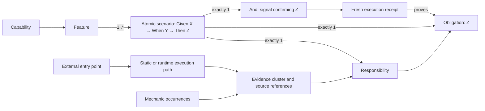

# Feature and Capability Traceability Strategic Roadmap

**Roadmap horizon:** Five continuous-delivery rounds

**Prepared:** 2026-08-04

**Target:** 100% honest, reproducible, end-to-end traceability for every released feature and capability

## Purpose

This roadmap converts the current analysis and governance capabilities into a monotonic delivery circuit. At the end of the fifth round, every released capability must be traceable through its features and atomic scenarios to executable responsibilities, source evidence, entry points, and fresh runtime proof. Every in-scope executable unit must also be traceable back to that governed product lineage. Dead or orphaned code must be deleted so it cannot pollute the inventory or inference signal.

The roadmap is based on:

- [Six Dimensions Analysis Guide](<./Six Dimensions Analysis Guide.md>)
- [Feature Coverage Execution Trace Analysis](<./Feature Coverage Execution Trace Analysis.md>)
- [CLI Entry Point Traceability Map](<./CLI Entry Point Traceability Map.md>)
- [Source Facts Query Cookbook](<./Source Facts Query Cookbook.md>)

The current generated [self-governance report](<../source-facts-self-governance-report.md>) was also used to distinguish the documented model from the repository's measured baseline.

## Executive recommendation

Adopt a five-step traceability ratchet:

1. **Define and measure** one reproducible denominator.
2. **Resolve execution reachability** in both directions and eliminate dead/orphaned code.
3. **Close canonical feature and capability lineage** using atomic one-responsibility/one-obligation scenarios.
4. **Prove scenarios at runtime and resolve dynamic execution.**
5. **Enforce 100% as a zero-regression delivery gate.**

The current estimate of approximately 95% method-to-CLI reachability is useful discovery evidence, but it is not a measure of feature or capability traceability. A feature is fully traced only when its static structure, governance lineage, execution path, and runtime evidence are all complete for the same source revision and subject scope.

## Documentation review

### What is already strong

| Foundation | Existing strength | Roadmap use |
|---|---|---|
| Six-dimensional analysis | Separates mechanics, implementation patterns, authority, features, scenarios, and queryable facts | Becomes the traceability scorecard rather than six disconnected analyses |
| Source-facts index | Provides symbols, relationships, mechanics, documents, and exact source references | Supplies the inventory and static evidence denominator |
| Feature projection | Discovers, validates, fingerprints, and classifies proposals deterministically | Supplies stable feature identity and an admission queue |
| Scenario governance | Models features, scenarios, obligations, responsibilities, bindings, and conformance signals | Supplies canonical lineage and structural-closure rules |
| CLI reachability analysis | Identifies entry points and demonstrates multi-hop impact analysis | Seeds the generated execution graph and reverse-reachability index |
| Query cookbook | Provides practical diagnostic queries across all six dimensions | Seeds executable KPI queries and regression assertions |

### Gaps that prevent an honest 100% claim

| Gap | Consequence | Required response |
|---|---|---|
| Counts and percentages are embedded in narrative snapshots | Documentation drifts as the source and scan boundary change | Generate metrics and tables from a versioned traceability report |
| The CLI map estimates approximately 95% and relies on manual recursion | Deep reachability is not reproducible or gateable | Materialize a complete forward and reverse execution graph |
| Callbacks, dynamic dispatch, and module-scope execution are incompletely modeled | Reachable behavior can look dead or remain ambiguous | Add synthetic nodes, dispatch evidence, and runtime resolution |
| Dead and orphaned code remains observable as source evidence | Pollution inflates denominators, creates false candidates, and weakens semantic inference | Delete it or deliberately reconnect it; do not normalize it as permanent inventory |
| Mechanics are evidence, but most have no canonical scenario lineage | Static observations cannot be attributed to released product behavior | Map evidence clusters to responsibilities and inherit lineage to mechanics |
| Proposed coverage is visible but not admitted | Discovery can be mistaken for governed coverage | Exclude proposed and ambiguous lineage from the coverage numerator |
| Capability is not yet a measured first-class relation | Feature coverage cannot roll up into stable product capability coverage | Introduce a separately versioned feature-to-capability relation |
| Structural analysis does not execute scenarios | `STRUCTURALLY_CLOSED` can be mistaken for conformant | Require current execution receipts for runtime coverage |
| The current report is observational | Regressions can merge without reducing any gate | Add staged warning, ratchet, and blocking policies |

### Reconciled baseline

The current self-governance report is scoped to `src` and identifies the following starting point:

| Measure | Current observation | Interpretation |
|---|---:|---|
| Canonical features | 4 | Governed feature set is small enough to prove the model before scaling |
| Proposed, not-admitted features | 1 | Proposal fingerprinting works, but admission remains open |
| Canonical scenarios | 6 | Runtime proof denominator starts at six and will grow with admissions |
| Structurally closed scenarios | 2 of 6 | Four scenarios still have structural status `NOT_EVALUATED` |
| Scenarios evaluated at runtime | 0 of 6 | Runtime proof coverage is 0% |
| Mechanics with canonical scenario lineage | 0 | No mechanic occurrence currently counts as canonical feature coverage |
| Mechanics with proposed scenario lineage | 158 | Useful discovery evidence, but not part of canonical coverage |
| Mechanics without scenario lineage | 4,940 | Primary lineage burn-down inventory |
| Authority documents with canonical lineage | 2 of 12 | Two more are proposed; eight are missing lineage |
| Unresolved evidence clusters | 574 | Better unit for governance review than 4,940 individual mechanics |
| Report disposition | `OBSERVATIONAL_NO_GATE_APPLIED` | No delivery control currently protects the baseline |

These figures must remain labeled with their scan ID, commit, subject scope, and generation time. The analysis documents also contain snapshot drift that Round 1 must eliminate. For example, the CLI document lists 30 runner functions, but that count is not reproduced by the current lexical inventory and changes again as the in-progress call-graph command is added; the feature-mechanics percentage column also does not reconcile to its stated total of 373. These are reasons to generate documentation from evidence, not reasons to manually maintain another count.

## Definition of 100% traceability

### Governed vocabulary

| Term | Role in the trace |
|---|---|
| **Capability** | A stable product or platform ability that groups one or more features |
| **Feature** | A governed, observable unit of behavior that may own multiple atomic scenarios |
| **Scenario** | One Given/When/Then circuit with exactly one obligation, one responsibility, and one conformance signal |
| **Obligation** | The single atomic result expressed by the scenario's `Then` statement |
| **Responsibility** | The scenario's single implementation owner, which discharges its obligation |
| **Evidence cluster** | A symbol or module-level group of related mechanics used for lineage review |
| **Mechanic occurrence** | Atomic source evidence; it inherits lineage and is not governed individually |
| **Execution receipt** | Version-bound evidence that a scenario and its proof were executed and passed |
| **Dead/orphaned code** | Executable source with no live entry-point path or governed consumer; pollution that must be deleted or deliberately reconnected |

### Atomic scenario normal form: the monotonic circuit

Every canonical scenario must use this normal form:

```text
Feature: <one governed feature; the feature may own many scenarios>
Scenario: <one atomic behavior>
Given: X
When: Y
Then: Z
And: <the one conformance signal that confirms Z was achieved>
Responsibility: <one implementation owner>
Obligation: <one atomic obligation, semantically identical to Z>
```

The post-`Then` `And` is reserved for evidence. It does not introduce another outcome. A second post-`Then` `And`, a second obligation, or a second responsibility means the scenario contains more than one behavioral circuit and must be split into separate scenarios.

The circuit is monotonic because a feature grows by adding independently traceable scenarios, not by widening an existing scenario until its proof becomes ambiguous. Once admitted, a scenario's `Given`, `When`, `Then`, responsibility, obligation, and signal form one versioned unit. Changing any member creates a new scenario version and invalidates receipts for the prior circuit; adding another scenario leaves existing valid circuits intact.

### Required end-to-end trace

Every released trace must support navigation in both directions:



The forward query answers, “How is this capability delivered and proved?” The reverse query answers, “Which capabilities, features, scenarios, and release proofs are affected by this source change?”

### Completeness dimensions

For a single versioned scope, calculate six independent ratios:

| Symbol | Ratio | 100% means |
|---|---|---|
| `I` | Inventory completeness | Every expected production artifact and executable unit was indexed |
| `R` | Reachability closure | Every released executable unit has a proven path from an entry point; every boundary is resolved and typed |
| `L` | Canonical lineage coverage | Every released evidence cluster inherits one canonical responsibility, obligation, scenario, and feature circuit |
| `C` | Capability mapping coverage | Every released feature maps to at least one canonical capability relation |
| `S` | Structural closure | Every canonical released scenario is in atomic normal form with exactly one responsibility, obligation, and signal, and has complete non-dangling lineage |
| `P` | Runtime proof coverage | Every canonical released scenario has a passing, current execution receipt |

The program score is deliberately non-compensating:

```text
strictTraceability = min(I, R, L, C, S, P)
```

An average is prohibited because 100% static reachability cannot compensate for 0% runtime proof. The final target is `I = R = L = C = S = P = 100%` for the same commit, index ID, subject-scope hash, and release candidate.

### Honest denominator rules

1. The denominator is generated from version-controlled production scope, never from whichever items already have lineage.
2. Proposed, ambiguous, stale, and `NOT_EVALUATED` records remain outside the numerator.
3. Shared infrastructure maps through a support relation to its consumer feature set; it never occupies a second responsibility slot in a scenario and does not become invisible infrastructure.
4. External dependencies terminate at an explicit external-boundary record and are not reported as unresolved internal calls.
5. Dead or orphaned code is never an acceptable final disposition. It must be deleted or deliberately reconnected to a governed live path.
6. Temporary quarantine is remediation only: it must sit outside released scope, have an owner and expiry, and cannot satisfy the Round 2 or Round 5 exit gate.
7. Experimental code must live in an explicitly separate non-production scope rather than polluting the released inventory.
8. Capability classification is a separate versioned relation so changing a capability taxonomy does not change the established feature fingerprint.
9. A feature may have multiple scenarios, but a scenario with multiple responsibilities, obligations, signals, or post-`Then` outcome conjunctions is structurally invalid and remains outside the numerator.

## Delivery strategy

Each round ships an independently useful increment and tightens the policy for the next round.

| Round | Theme | Delivery value | Gate evolution |
|---:|---|---|---|
| 1 | Trustworthy baseline | One reproducible inventory, contract, and scorecard | Report-only; fail only on invalid or non-reproducible evidence |
| 2 | Execution graph closure | Reliable forward/reverse reachability and impact analysis | Warn, then block net-new unresolved internal reachability |
| 3 | Canonical lineage closure | Every released implementation assigned to features and capabilities | Block net-new or remaining missing/proposed lineage in release scope |
| 4 | Runtime proof closure | Every released scenario executed and proved on the current revision | Block `NOT_EVALUATED`, stale, failed, or unresolved dynamic paths |
| 5 | Continuous 100% enforcement | Strict traceability is automatic, durable, and zero-regression | Block any dimension below 100% |

## Round 1 — Establish the traceability contract and baseline

### Objective

Replace narrative estimates with a deterministic, versioned measurement system. This round defines what is in scope, what a complete trace contains, and how every ratio is calculated.

### Delivery scope

1. Create a versioned `traceability-contract.v1` containing:
   - production and excluded path rules;
   - artifact and executable-unit definitions;
   - entry-point types;
   - atomic scenario cardinalities and the single post-`Then` signal rule;
   - allowed trace dispositions;
   - metric formulas and severity policy.
2. Generate the entry-point inventory from source facts rather than a hard-coded list. Distinguish:
   - top-level CLI commands;
   - CLI subcommands and internal dispatchers;
   - HTTP/server entry points;
   - public module/API entry points;
   - proof and migration scripts that are not product entry points.
3. Establish stable identities for module-scope execution and anonymous callbacks.
4. Turn the essential cookbook queries into named, executable query assets with expected schemas.
5. Emit a `traceability-baseline.v1` report in JSON and Markdown, bound to:
   - repository and commit;
   - index ID and scan ID;
   - subject-scope hash;
   - generation timestamp;
   - all metric denominators and dispositions.
6. Add a structural validator that reports scenarios with multiple obligations, responsibilities, signals, or post-`Then` conjunctions.
7. Generate documentation tables from that report or clearly label them as historical snapshots.

### Existing work to reuse

The current `src/call-graph.js` prototype and `call-graph` CLI wiring are a strong starting point for Rounds 1 and 2. Before it becomes evidence, its default scope must align with indexes rooted at `src`, and its unresolved calls must be separated into internal defects, external boundaries, member calls, and dynamic dispatch.

### Exit criteria

- 100% of version-controlled production files have an explicit in-scope or excluded disposition.
- 100% of entry points are generated, typed, and linked to source references.
- All six ratios have executable definitions and reproduce identically from the same revision.
- Every canonical scenario receives an explicit atomic-normal-form result; violations are visible as baseline debt and never counted as structural closure.
- Every published metric includes the same index, scan, and scope identity.
- The documented runner count, mechanics total, and coverage tables are generated or snapshot-labeled.
- A clean checkout can regenerate the baseline without manual edits.

### Released outcome

The team can trust the denominator and can see gaps without yet claiming coverage. The delivery policy remains observational, but invalid or non-reproducible reports fail.

## Round 2 — Close static execution reachability

### Objective

Make every executable unit and evidence cluster navigable from entry points and back to affected entry points. Eliminate manual recursion, distinguish true internal gaps from valid execution boundaries, and remove dead/orphaned source noise.

### Delivery scope

1. Materialize a supplementary forward and reverse call-graph index, as recommended by the CLI traceability analysis.
2. Traverse to a fixpoint with cycle protection; record shortest witness paths and all reachable roots.
3. Resolve symbols using stable IDs and module imports before falling back to name matching.
4. Extend the graph taxonomy to include:
   - direct invocation;
   - callback registration and invocation;
   - higher-order array callbacks;
   - module evaluation;
   - data-driven wiring;
   - dynamic dispatch candidates;
   - explicit external dependency boundaries.
5. Add synthetic callable identities for anonymous functions and module scope.
6. Attach each evidence cluster to its reachable entry-point set and minimum-depth witness.
7. Expose two supported queries:
   - entry point to all downstream executable units and clusters;
   - symbol or cluster to all affected entry points.
8. Add fixtures for overloaded names, callbacks, cycles, unresolved imports, member calls, and dispatch tables.

### Exit criteria

- 100% of in-scope callable units receive one reachability disposition during analysis: `REACHABLE`, `SHARED_SUPPORT`, `RUNTIME_RESOLUTION_REQUIRED`, or `UNREACHABLE`.
- No in-scope internal invocation edge remains generically unresolved; each edge is resolved or assigned a precise typed boundary.
- Every released entry point has at least one deterministic path witness.
- Every reachable evidence cluster lists all originating entry points.
- Dead and orphaned production callables, modules, mechanics, and evidence clusters are zero: each discovered item is deleted or deliberately reconnected to a governed live path before the round exits.
- Temporary quarantine cannot satisfy the round exit and automatically fails after its remediation expiry.
- CI blocks net-new unclassified callables and net-new unresolved internal edges.

### Released outcome

Static impact analysis becomes reliable and automated. Runtime-dependent edges are isolated as an explicit Round 4 backlog instead of being hidden inside a 95% estimate, while dead/orphaned source pollution has been removed rather than carried forward as traceability debt.

## Round 3 — Close canonical feature and capability lineage

### Objective

Assign every released evidence cluster to governed product meaning and make every canonical scenario structurally complete. This is the round that converts code reachability into feature/capability coverage.

### Delivery scope

1. Introduce a versioned capability registry and feature-to-capability relation with its own deterministic fingerprint.
2. Preserve existing feature fingerprint semantics; capability taxonomy changes must not silently change feature identity.
3. Resolve the baseline evidence backlog at the cluster level:
   - product behavior becomes a responsibility in a canonical scenario;
   - shared implementation remains outside the atomic scenario's responsibility slot and gains explicit consumer-feature edges;
   - duplicate or dead implementation is removed;
   - experimental or generated-only code is moved outside released scope.
4. Prioritize the 574 unresolved clusters by product risk:
   - entry-point and security boundaries;
   - high-coupling clusters;
   - serialization, validation, mutation, exception, and external-I/O clusters;
   - remaining supporting clusters.
5. Review and admit, merge, reject, or supersede every pending feature proposal. Do not count a proposal as canonical while it is awaiting a decision.
6. Resolve authority documents, admitted know-how, and healing drafts that lack canonical targets.
7. Enforce the complete structural chain:
   - a feature owns one or more atomic scenarios;
   - a scenario owns exactly one obligation, one responsibility, and one conformance signal;
   - the `Then` statement and obligation describe the same atomic result;
   - the sole post-`Then` `And` names the signal that confirms that result;
   - the responsibility discharges that obligation;
   - shared utilities connect through supporting consumer edges, never as a second responsibility;
   - scenario to feature;
   - feature to one or more capabilities;
   - binding to observed implementation evidence.
8. Inherit lineage from clusters to their mechanics so thousands of occurrences do not require hand-authored authority records.

### Exit criteria

- 100% of released evidence clusters have canonical product lineage or a canonical support relation with named consumer features.
- `FEATURE_COVERAGE_MISSING` is zero for the released subject.
- Proposed and ambiguous coverage are zero for the released subject; each item is admitted, rejected, superseded, or removed.
- 100% of released features map to at least one canonical capability.
- 100% of canonical released scenarios are `STRUCTURALLY_CLOSED`.
- 100% of canonical released scenarios pass atomic normal form: one `Given`, one `When`, one `Then`, one post-`Then` signal, one obligation, and one responsibility.
- Scenarios with multiple post-`Then` `And` statements are zero; any such behavior has been split into separately provable scenarios.
- Dangling obligations, responsibilities, bindings, authority documents, know-how records, and healing targets are zero.
- Every lineage-quality finding has been resolved; an owner alone is not sufficient for the exit gate.
- CI blocks any new canonical-lineage or structural-closure regression.

### Released outcome

Static feature and capability traceability reaches 100%. The remaining gap is explicitly runtime proof, so the strict composite score is still below 100% until Round 4.

## Round 4 — Prove runtime conformance and dynamic execution

### Objective

Execute every canonical released scenario, ingest trustworthy proof, and use runtime evidence to close callbacks and dynamic-dispatch paths that static analysis cannot decide.

### Delivery scope

1. Create a versioned `scenario-execution-receipt.v1` containing at least:
   - one feature/capability context and exactly one scenario, obligation, responsibility, and signal identity;
   - commit, index ID, scan ID, and subject-scope hash;
   - proof command and verifier identity;
   - environment and dependency identity;
   - start/end timestamps;
   - relevant input/output artifact hashes;
   - pass, fail, or not-evaluated verdict with reason.
2. Generate exactly one scenario proof circuit from each canonical conformance signal; the receipt must prove the scenario's single `Then`/obligation.
3. Map current unit, conformance, smoke, browser, server, and migration proofs to canonical scenarios rather than relying on filename conventions.
4. Add missing scenario-level proofs, including negative paths for validation, loopback/security, error handling, and duplicate prevention where applicable.
5. Instrument dynamic dispatch and callback boundaries with stable trace IDs; reconcile observed edges with static candidates.
6. Ingest receipts into the self-governance report and make receipt freshness part of the coverage calculation.
7. Run impacted proofs on pull requests and the complete scenario suite on merge and release candidates.

### Exit criteria

- 100% of canonical released scenarios have execution evaluated on the candidate revision.
- 100% of canonical released scenarios are conformant by a passing, current receipt.
- Runtime conformance `NOT_EVALUATED` is zero in released scope.
- Structural evaluation limits are zero in released scope.
- Every dynamic-dispatch or callback edge affecting released behavior is resolved by static configuration or observed runtime evidence.
- A receipt from a different commit, scope, index, or material environment cannot satisfy the gate.
- Failed, skipped, stale, or missing proofs fail the release candidate.

### Released outcome

All six completeness dimensions can reach 100% for a single release candidate. Traceability is now evidence-backed rather than inferred from static presence.

## Round 5 — Make 100% durable in continuous delivery

### Objective

Turn the one-time 100% result into the default operating condition. Every code change must preserve or restore full traceability before release.

### Delivery scope

1. Add a single traceability gate that performs, in order:
   - clean source-facts projection and index validation;
   - scope and entry-point inventory;
   - execution-graph projection and validation;
   - feature/capability lineage and structural validation;
   - impacted scenario proofs;
   - full release proof suite;
   - strict score calculation and artifact publication.
2. Add change-impact reporting to every delivery:
   - changed source to affected responsibilities, scenarios, features, and capabilities;
   - changed authority to affected implementation and proof paths;
   - added entry points or executable units to required lineage work.
3. Publish immutable traceability JSON, Markdown, graph, and receipt artifacts for each release.
4. Add ownership and service levels:
   - same-change lineage for new behavior;
   - no proposal backlog in released scope;
   - current-revision proof before merge or release;
   - immediate failure on scope or denominator shrinkage without an approved source change.
5. Make the documentation derive its current metrics and examples from the most recent accepted evidence bundle.
6. Prove the gate itself with mutation fixtures that introduce missing lineage, dangling references, dynamic ambiguity, stale receipts, dead code, and scope manipulation.
   Include mutations that add a second obligation, a second responsibility, or a second post-`Then` `And` to an otherwise valid scenario.
7. Retain the previous accepted evidence bundle with the release so rollback restores code and its matching proof set together.

### Exit criteria

- `I = R = L = C = S = P = 100%` for the same release candidate.
- Missing, proposed, ambiguous, unresolved, structurally not-evaluated, runtime not-evaluated, stale, and failed counts are all zero in released scope.
- Dead and orphaned production code is zero; expired quarantine is zero.
- Every scenario satisfies the atomic one-responsibility/one-obligation/one-signal circuit.
- The strict gate passes from a clean checkout with no pre-existing generated artifacts.
- Two consecutive mainline delivery candidates pass without a manual waiver or denominator adjustment.
- Both navigation directions work for every released capability:
  - capability to feature, scenario, implementation, entry point, and proof;
  - changed source to affected responsibility, scenario, feature, capability, and proof suite.
- Any regression below 100% blocks the release.

### Released outcome

Traceability is a continuous property of the delivery system, not a periodic documentation exercise.

## Cumulative target scorecard

| Measure | Baseline | Round 1 | Round 2 | Round 3 | Round 4 | Round 5 |
|---|---:|---|---|---|---|---|
| Versioned inventory denominator | Drifting snapshots | 100% reproducible | 100% | 100% | 100% | 100% gated |
| Reachability disposition | Approximately 95% estimate | Measured | 100% classified; static internal gaps zero | 100% | 100% dynamically resolved | 100% gated |
| Dead/orphaned production code | Not reliably measured | Inventoried | Zero | Zero | Zero | Zero gated |
| Canonical mechanic/cluster lineage | 0 canonical mechanics; 574 unresolved clusters | Measured | Cluster reachability attached | 100% | 100% | 100% gated |
| Feature-to-capability mapping | Not reliably measured | Contract defined | Pilot mappings | 100% | 100% | 100% gated |
| Atomic scenario normal form | Not measured | Contract and validator defined | Violations visible | 100% | 100% | 100% gated |
| Scenario structural closure | 2 of 6 | Measured | Priority blockers visible | 100% | 100% | 100% gated |
| Scenario runtime proof | 0 of 6 | Receipt contract defined | Proof harness pilot | Proof backlog explicit | 100% current | 100% gated |
| Strict composite | Not measurable | Visible, not claimed | Below 100% by design | Static dimensions complete | 100% achieved | 100% sustained |

## Cross-round workstreams and ownership

| Workstream | Accountable role | Primary responsibility |
|---|---|---|
| Inventory and graph | Source-facts/platform engineering | Stable identities, indexing, reachability, impact queries |
| Feature and capability governance | Product/architecture governance | Capability taxonomy, feature admission, scenario and obligation quality |
| Implementation lineage | Feature engineering owners | Evidence-cluster disposition, responsibility bindings, removal of dead code |
| Runtime evidence | Quality/conformance engineering | Proof manifests, execution harnesses, receipt integrity, dynamic resolution |
| Delivery control | Build/release engineering | Ratcheted CI policy, artifact retention, release and rollback integration |

The ownership model must be represented in the trace data. A spreadsheet or meeting decision that cannot be regenerated from version control is not sufficient evidence.

## Primary risks and controls

| Risk | Control |
|---|---|
| Denominator gaming by narrowing scope | Version and diff the scope manifest; fail unexplained denominator shrinkage |
| Treating mechanics as semantic features | Govern at evidence-cluster/responsibility level and inherit lineage to mechanics |
| Treating proposals as coverage | Keep `PROPOSED`, `AMBIGUOUS`, and `CANONICAL` numerators separate |
| False reachability from name matching | Prefer symbol IDs and import resolution; test overloads and duplicate names |
| False dead-code results for callbacks or dynamic dispatch | Model registrations statically and require runtime edge receipts |
| Dead/orphaned code polluting inference and coverage | Delete it or reconnect it before release; permit only expiring, non-release remediation quarantine |
| Shared utilities creating authority explosion | Use support relations with explicit consumer feature sets; do not add responsibilities to atomic scenarios |
| Stale proofs satisfying a later release | Bind receipts to commit, index, scope, environment, and artifact hashes |
| Slow full-suite feedback | Run impact-selected proofs on pull requests and the full suite on merge/release |
| Permanent waivers masking gaps | Quarantine or remove non-release code; never count a waiver in the numerator |
| Documentation drifting from implementation | Generate current tables and examples from the accepted evidence bundle |

## Final definition of done

The evolution is complete when a clean release candidate produces one accepted evidence bundle in which:

- every production artifact and executable unit is in the inventory;
- every released execution path is resolved from an external entry point;
- dead and orphaned production code is zero;
- every mechanic inherits canonical lineage through an evidence cluster and responsibility;
- every scenario is structurally closed, belongs to a feature, and contains exactly one responsibility, one obligation, and one conformance signal;
- every scenario has exactly one post-`Then` `And`, reserved for the signal that proves its single `Then` result;
- every feature belongs to at least one capability;
- every scenario has a passing, current execution receipt;
- every reverse-impact query returns the relevant capabilities and proof suite;
- no proposed, ambiguous, missing, unresolved, stale, failed, or `NOT_EVALUATED` state remains in released scope;
- the continuous-delivery gate rejects an intentional traceability defect.

At that point, “100% traceability” means complete, current evidence for released behavior—not a static estimate, a documentation claim, or an average across incomplete dimensions.
