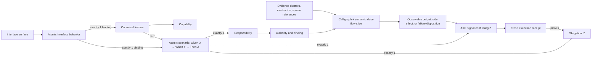

# Feature and Capability Traceability Strategic Roadmap

**Roadmap horizon:** Five continuous-delivery rounds

**Prepared:** 2026-08-04

**Target:** 100% honest, reproducible, end-to-end traceability for every released feature and capability

## Purpose

This roadmap converts the current analysis and governance capabilities into an interface-first monotonic delivery circuit. Each coverage circuit begins with a real atomic interface behavior—not a file, function, or mechanic—and traces through its canonical feature, scenario, responsibility, obligation, authority, call/data-flow slice, observable outcome, confirming signal, and fresh runtime proof. Every in-scope executable unit must trace back to that governed product lineage or an admitted support/platform consumer path. Dead or orphaned code must be deleted so it cannot pollute the inventory or inference signal.

The roadmap is based on:

- [Six Dimensions Analysis Guide](<./Six Dimensions Analysis Guide.md>)
- [Feature Coverage Execution Trace Analysis](<./Feature Coverage Execution Trace Analysis.md>)
- [CLI Entry Point Traceability Map](<./CLI Entry Point Traceability Map.md>)
- [Source Facts Query Cookbook](<./Source Facts Query Cookbook.md>)

The current generated [self-governance report](<../source-facts-self-governance-report.md>) was also used to distinguish the documented model from the repository's measured baseline.

## Executive recommendation

Adopt a five-step traceability ratchet:

1. **Inventory and normalize interface behaviors** to establish one reproducible denominator.
2. **Resolve execution reachability** in both directions and eliminate dead/orphaned code.
3. **Bind interface behaviors to canonical feature and capability lineage** using atomic one-responsibility/one-obligation scenarios.
4. **Prove scenarios at runtime and resolve dynamic execution.**
5. **Enforce 100% as a zero-regression delivery gate.**

The current measured CLI-slice reachability is useful discovery evidence, but it is not a measure of feature or capability traceability. A feature is fully traced only when its interface bindings, static structure, governance lineage, call and semantic data-flow paths, observable outcomes, and runtime evidence are all complete for the same source revision and subject scope.

## Documentation review

### What is already strong

| Foundation | Existing strength | Roadmap use |
|---|---|---|
| Six-dimensional analysis | Separates mechanics, implementation patterns, authority, features, scenarios, and queryable facts | Becomes the traceability scorecard rather than six disconnected analyses |
| Source-facts index | Provides symbols, relationships, mechanics, documents, and exact source references | Supplies the inventory and static evidence denominator |
| Feature projection | Discovers, validates, fingerprints, and classifies proposals deterministically | Supplies stable feature identity and an admission queue |
| Scenario governance | Models features, scenarios, obligations, responsibilities, bindings, and conformance signals | Supplies canonical lineage and structural-closure rules |
| CLI reachability analysis | Identifies CLI surfaces and demonstrates multi-hop impact analysis; a deterministic CLI graph now implements the initial slice | Supplies the first generated execution-graph slice and seeds reverse navigation |
| Query cookbook | Provides candidate diagnostic queries across all six dimensions | Seeds a compatibility-tested query catalog; examples do not become supported until their tests pass |

### Gaps that prevent an honest 100% claim

| Gap | Consequence | Required response | Status |
|---|---|---|---|
| Counts and percentages are embedded in narrative snapshots | Documentation drifts as the source and scan boundary change | Generate metrics and tables from a versioned traceability report | ✅ [Closed](Round-1-Documentation-Generation.md) |
| The CLI map now measures the CLI slice, but broader entry-point families and reverse navigation are still incomplete | Deep reachability is reproducible for the CLI slice, but not yet for the whole repository | Materialize a complete forward and reverse execution graph and widen the entry-point taxonomy | ✅ [Closed](Round-2-Bidirectional-Reachability.md) |
| Surface names are not yet normalized into atomic interface behaviors | One command, route, or method can hide several distinct outcomes and obligations | Inventory input/action/outcome behavior slices before feature discovery |
| Callbacks, dynamic dispatch, and module-scope execution are incompletely modeled | Reachable behavior can look dead or remain ambiguous | Add synthetic nodes, dispatch evidence, and runtime resolution |
| The call graph does not by itself prove semantic flow | Invocation edges cannot show which input, authority, outcome, side effect, or failure closes a scenario | Build surface-to-outcome semantic data-flow slices alongside the call graph |
| Current feature inference starts from a bounded mechanic/query cluster rather than a complete interface behavior packet | A proposal can mirror implementation shape instead of a coherent interface experience | Compare canonical surface bindings first, then infer only from uncovered interface packets |
| Dead and orphaned code remains observable as source evidence | Pollution inflates denominators, creates false candidates, and weakens semantic inference | Delete it or deliberately reconnect it; do not normalize it as permanent inventory |
| Mechanics are evidence, but most have no canonical scenario lineage | Static observations cannot be attributed to released product behavior | Map evidence clusters to responsibilities and inherit lineage to mechanics |
| Proposed coverage is visible but not admitted | Discovery can be mistaken for governed coverage | Exclude proposed and ambiguous lineage from the coverage numerator |
| Capability is not yet a measured first-class relation | Feature coverage cannot roll up into stable product capability coverage | Introduce a separately versioned feature-to-capability relation |
| Structural analysis does not execute scenarios | `STRUCTURALLY_CLOSED` can be mistaken for conformant | Require current execution receipts for runtime coverage |
| Generated analysis mixes facts, derivations, interpretations, and recommendations | Plausible prose can be mistaken for deterministic repository truth | Require typed claim receipts and excerpt provenance for every generated analysis claim |
| Cookbook queries are not continuously executed against the current schema | Useful-looking SQL can be rejected or silently return an empty result | Register queries as tested assets with schema, result-shape, and compatibility assertions |
| The cognition-multiplier conclusion has no controlled comparison | A compelling case study can be mistaken for proof of model uplift | Run a pre-registered raw-repository versus SourceFacts evaluation with the same model and questions |
| The current report is observational | Regressions can merge without reducing any gate | Add staged warning, ratchet, and blocking policies |

### Reconciled baseline

The current self-governance report is scoped to `src` and identifies the following starting point:

| Measure | Current observation | Interpretation |
|---|---:|---|
| Canonical features | 4 | Governed feature set is small enough to prove the model before scaling |
| Proposed, not-admitted features | 1 | Proposal fingerprinting works, but admission remains open |
| Canonical scenarios | 6 | Runtime proof denominator starts at six and will grow with admissions |
| Structurally closed scenarios | 2 of 6 | Four scenarios still have structural status `NOT_EVALUATED` |
| Scenarios evaluated at runtime | 0 of 6 | Runtime proof coverage is 0% |
| Mechanics with canonical scenario lineage | 0 | No mechanic occurrence currently counts as canonical feature coverage |
| Mechanics with proposed scenario lineage | 158 | Useful discovery evidence, but not part of canonical coverage |
| Mechanics without scenario lineage | 4,940 | Primary lineage burn-down inventory |
| Authority documents with canonical lineage | 2 of 12 | Two more are proposed; eight are missing lineage |
| Unresolved evidence clusters | 574 | Better unit for governance review than 4,940 individual mechanics |
| Report disposition | `OBSERVATIONAL_NO_GATE_APPLIED` | No delivery control currently protects the baseline |

These figures must remain labeled with their scan ID, commit, subject scope, and generation time. The analysis documents also contain snapshot drift that Round 1 must eliminate. For example, the CLI document lists 30 runner functions, but that count is not reproduced by the current lexical inventory and changes again as the call-graph command is added to the evidence pipeline; the feature-mechanics percentage column also does not reconcile to its stated total of 373. These are reasons to generate documentation from evidence, not reasons to manually maintain another count.

## Verification outcome: real leverage, bounded claim

The supplied leverage assessment is directionally correct, but the strongest defensible conclusion is narrower than “proved cognition multiplier.” SourceFacts has demonstrated that a lower-cost model can consume bounded, hashed query evidence and produce a deterministically validated feature proposal. The repository does not yet contain the provenance or controlled comparison needed to prove that the four analysis documents were authored from SourceFacts alone or that SourceFacts caused a measurable improvement over raw-repository analysis.

| Assessment claim | Verdict | Evidence and qualification |
|---|---|---|
| Structured facts and governance vocabulary can raise the floor of agent analysis | **Supported case study** | The artifacts use the indexed mechanics, symbols, relationships, feature, scenario, and authority vocabulary coherently; a recorded `gemini-flash-latest` feature-inference run consumed a 20-row hashed query receipt and produced a proposal that passed deterministic validation and fingerprinting |
| A low-tier agent produced all four documents from the facts substrate | **Not independently verifiable** | Git records the documents, but no document-generation receipt identifies the model, prompt, queries, source access, or result hashes |
| The independent call-graph recommendation was correct | **Confirmed** | A deterministic recursive CLI call-graph builder and CLI command now exist, and their focused tests pass |
| The cookbook is already a usable query catalog | **Partially confirmed** | Representative mechanic-distribution queries execute, but other documented examples are rejected by the current parser or reference fields absent from the current relationship schema |
| The feature pipeline is one execution chain: discover → evaluate → propose → project | **Rejected as a single path** | Proposal/evaluation discovery and projection occur under `runGovern`; live proposal generation occurs under the separate `runProposeFeatureCoverage` surface. The model invocation is also hidden behind an injected `invoke` function and is not yet closed by the static graph |
| Approximately 95% method-to-CLI completeness is established | **Rejected as a measured claim** | The deterministic graph reports exact dispositions for its current scope, but unresolved, dynamic, external, non-CLI, and truly dead units are not yet fully separated |
| The documents are a seed for a SourceFacts Repository Analyst skill | **Confirmed design opportunity** | The repeated workflow—select facts, run bounded queries, traverse paths, type claims, and propose missing coverage—is clear enough to govern and evaluate |
| SourceFacts is an agent cognition multiplier | **Strategic hypothesis** | The case study justifies investment; causal proof requires a controlled, repeatable evaluation across accuracy, evidence quality, unsupported-claim rate, time, tokens, and cost |

The roadmap therefore productizes both sides of the result: the **analysis leverage** and the **quality boundary** that prevents an agent interpretation from becoming repository truth.

## Definition of 100% traceability

### Governed vocabulary

| Term | Role in the trace |
|---|---|
| **Capability** | A stable product or platform ability that groups one or more features |
| **Interface surface** | A real CLI command, UI action, HTTP route, API operation, SDK method, event handler, or scheduled trigger from which released behavior is entered |
| **Interface behavior** | One normalized input/action/outcome slice of an interface surface; the atomic root of feature-coverage discovery |
| **Interface binding** | A canonical relation from one interface behavior to exactly one feature and one atomic scenario |
| **Feature** | A governed, observable unit of behavior that may own multiple atomic scenarios |
| **Scenario** | One Given/When/Then circuit with exactly one obligation, one responsibility, and one conformance signal |
| **Obligation** | The single atomic result expressed by the scenario's `Then` statement |
| **Responsibility** | The scenario's single implementation owner, which discharges its obligation |
| **Evidence cluster** | A symbol or module-level group of related mechanics used for lineage review |
| **Mechanic occurrence** | Atomic source evidence; it inherits lineage and is not governed individually |
| **Execution receipt** | Version-bound evidence that a scenario and its proof were executed and passed |
| **Analysis claim** | A typed statement about the repository whose evidence and derivation can be inspected |
| **Claim receipt** | Version-bound provenance for a fact, query result, graph path, runtime observation, interpretation, or recommendation |
| **Dead/orphaned code** | Executable source with no live interface-behavior path or governed consumer; pollution that must be deleted or deliberately reconnected |

### Atomic scenario normal form: the monotonic circuit

Every canonical scenario must use this normal form:

```text
Feature: <one governed feature; the feature may own many scenarios>
Scenario: <one atomic behavior>
Given: X
When: Y
Then: Z
And: <the one conformance signal that confirms Z was achieved>
Responsibility: <one implementation owner>
Obligation: <one atomic obligation, semantically identical to Z>
```

The post-`Then` `And` is reserved for evidence. It does not introduce another obligation. It may express the paired invariant or rejection disposition only when that observation confirms the same `Then`/obligation boundary. If it asserts an independent outcome, or if a second post-`Then` `And`, obligation, or responsibility is needed, the behavior contains more than one circuit and must be split into separate scenarios.

The circuit is monotonic because a feature grows by adding independently traceable scenarios, not by widening an existing scenario until its proof becomes ambiguous. Once admitted, a scenario's `Given`, `When`, `Then`, responsibility, obligation, and signal form one versioned unit. Changing any member creates a new scenario version and invalidates receipts for the prior circuit; adding another scenario leaves existing valid circuits intact.

### Interface-first coverage root

Feature coverage begins from an inventory of real interface behaviors, not from files, functions, or mechanic counts.

| Surface kind | Required normalized evidence |
|---|---|
| CLI command | command/subcommand, arguments and flags, output, exit disposition, side effects |
| UI action | user action, relevant view state, emitted command/event, observable state or navigation result |
| HTTP/API operation | method, route/operation ID, request contract, response contract, failure dispositions, side effects |
| SDK method | public method identity, input contract, returned result, invoked capability, failure contract |
| Event handler | event identity/schema, subscription/registration, processing result, retry/failure disposition |
| Scheduled trigger | schedule identity, trigger contract, invoked operation, output/side effect, failure disposition |

The cardinality rules are:

```text
Interface surface       1 -> 1..* interface behaviors
Interface behavior      1 -> exactly 1 canonical feature
Interface behavior      1 -> exactly 1 atomic scenario
Canonical feature       1 -> 1..* atomic scenarios
Atomic scenario         1 -> exactly 1 responsibility
Atomic scenario         1 -> exactly 1 obligation
Atomic scenario         1 -> exactly 1 confirming signal
Atomic scenario         1 <- 1..* interface bindings are allowed
```

This allows one command to expose multiple atomic behaviors and allows a new CLI, API, or SDK surface to bind to an existing feature/scenario without duplicating feature identity. No individual function receives its own feature merely because it exists.

### Analysis claim normal form

Every machine-generated repository statement must carry an `analysis-claim-receipt.v1` with:

- claim ID, text, subject, and claim kind;
- commit, index ID, scan ID, and subject-scope hash;
- query receipt IDs and result hashes, graph witness paths, runtime receipts, or exact source references;
- the deterministic derivation or model-inference receipt used;
- confidence and a disposition that remains separate from the model's self-reported confidence;
- excerpt provenance: `SOURCE_EXCERPT`, `SOURCE_DERIVED_PSEUDOCODE`, or `AGENT_RECONSTRUCTION`.

| Claim kind | May satisfy a delivery gate? | Required evidence |
|---|---|---|
| `DIRECT_SOURCE_FACT` | Yes | Current source reference and content/hash identity |
| `DERIVED_QUERY_CLAIM` | Yes | Registered query version plus successful input/result receipt |
| `DERIVED_GRAPH_CLAIM` | Yes | Complete current graph witness with all internal edges resolved |
| `RUNTIME_OBSERVATION` | Yes | Fresh execution receipt bound to the release candidate |
| `AGENT_INTERPRETATION` | No | Supporting observations, uncertainty, model receipt, and explicit interpretation label |
| `RECOMMENDATION` | No | Typed rationale and linked facts/interpretations; never presented as current state |

Mechanic density may therefore support “mechanically dense,” not “complex.” Unreachability may support “dead-code candidate,” not “dead,” until import, registration, public API, and runtime evidence are closed. Aggregate operation counts never prove execution order.

### Required end-to-end trace

Every released trace must support navigation in both directions:



The forward query answers, “How is this capability delivered and proved?” The reverse query answers, “Which capabilities, features, scenarios, and release proofs are affected by this source change?”

### Completeness dimensions

For a single versioned scope, calculate eight independent ratios:

| Symbol | Ratio | 100% means |
|---|---|---|
| `I` | Interface and inventory completeness | Every real production interface behavior, artifact, and executable unit was indexed |
| `R` | Reachability closure | Every released executable unit has a proven call-graph path from an admitted interface behavior or governed platform surface; every boundary is resolved and typed |
| `D` | Semantic data-flow closure | Every interface input, authority input, responsibility, output/side effect, failure disposition, and confirming signal is connected on the scenario's execution slice |
| `L` | Canonical lineage coverage | Every interface behavior has one canonical feature/scenario binding, and every released evidence cluster is justified by that circuit or an admitted support/platform relation |
| `C` | Capability mapping coverage | Every released feature maps to at least one canonical capability relation |
| `S` | Structural closure | Every canonical released scenario is in atomic normal form with exactly one responsibility, obligation, and signal, and has complete non-dangling lineage |
| `P` | Runtime proof coverage | Every canonical released scenario has a passing, current execution receipt |
| `E` | Evidence integrity | Every released traceability claim has an allowed claim kind, reproducible current evidence, and explicit excerpt/interpretation provenance |

The program score is deliberately non-compensating:

```text
strictTraceability = min(I, R, D, L, C, S, P, E)
```

An average is prohibited because 100% static reachability cannot compensate for 0% semantic data-flow closure, runtime proof, or evidence integrity. The final target is `I = R = D = L = C = S = P = E = 100%` for the same commit, index ID, subject-scope hash, and release candidate.

### Honest denominator rules

1. The denominator is generated from version-controlled production scope, never from whichever items already have lineage.
2. Proposed, ambiguous, stale, and `NOT_EVALUATED` records remain outside the numerator.
3. Shared infrastructure maps through a support relation to its consumer feature set; it never occupies a second responsibility slot in a scenario and does not become invisible infrastructure.
4. External dependencies terminate at an explicit external-boundary record and are not reported as unresolved internal calls.
5. Dead or orphaned code is never an acceptable final disposition. It must be deleted or deliberately reconnected to a governed live path.
6. Temporary quarantine is remediation only: it must sit outside released scope, have an owner and expiry, and cannot satisfy the Round 2 or Round 5 exit gate.
7. Experimental code must live in an explicitly separate non-production scope rather than polluting the released inventory.
8. Capability classification is a separate versioned relation so changing a capability taxonomy does not change the established feature fingerprint.
9. A feature may have multiple scenarios, but a scenario with multiple responsibilities, obligations, signals, or post-`Then` outcome conjunctions is structurally invalid and remains outside the numerator.
10. An interpretation, recommendation, reconstructed excerpt, model confidence score, or unresolved graph candidate can never satisfy a traceability gate as though it were a deterministic fact.
11. Each admitted interface behavior binds to exactly one feature and one scenario. Additional surfaces reaching the same behavior create additional bindings, not duplicate features.
12. Reachability and code justification are separate dispositions: “reachable” does not prove canonical lineage, and “currently unreachable” does not prove deadness.
13. Shared support and platform primitives are valid only when they have admitted consumer paths or a real governed public/platform surface. Classification cannot legitimize unused speculative code.

### Two-axis code justification posture

Every executable node receives both a reachability disposition and a justification disposition.

| Axis | Allowed dispositions |
|---|---|
| Reachability | `REACHABLE`, `RUNTIME_RESOLUTION_REQUIRED`, `UNREACHABLE` |
| Code justification | `FEATURE_ROOT`, `FEATURE_RESPONSIBILITY`, `SHARED_SUPPORT`, `PLATFORM_PRIMITIVE`, `TEST_ONLY`, `GENERATED_ARTIFACT`, `NO_CANONICAL_INTERFACE_LINEAGE`, `AMBIGUOUS_LINEAGE` |

`NO_CANONICAL_INTERFACE_LINEAGE` is mandatory quarantine inventory because the graph contains behavior that cannot yet be justified by an admitted interface experience. It triggers review for a missing interface declaration, obsolete or speculative behavior, a duplicate path, hidden side effect, bad graph evidence, or abandoned implementation. Nothing is deleted automatically from this initial signal: review must reconnect it to admitted lineage, classify a real support/platform surface, or delete it. Quarantine is temporary and must be zero at the Round 3 and Round 5 exit gates.

`TEST_ONLY` and `GENERATED_ARTIFACT` are separate governed scopes, not escape hatches for production behavior. A production path that depends on either must expose and govern that dependency.

## Delivery strategy

Each round ships an independently useful increment and tightens the policy for the next round.

| Round | Theme | Delivery value | Gate evolution |
|---:|---|---|---|
| 1 | Interface and evidence baseline | One reproducible surface/behavior inventory, claim contract, tested query catalog, and scorecard | Report-only; fail only on invalid or non-reproducible evidence |
| 2 | Surface-to-outcome graph closure | Reliable call and semantic data-flow slices, graph-claim receipts, reverse navigation, and impact analysis | Warn, then block net-new unresolved internal reachability, data-flow gaps, or unsupported graph claims |
| 3 | Canonical lineage closure | Every released implementation assigned to features and capabilities | Block net-new or remaining missing/proposed lineage in release scope |
| 4 | Runtime proof and analyst evaluation | Every released scenario executed and proved; SourceFacts agent leverage measured under a controlled comparison | Block `NOT_EVALUATED`, stale, failed, or unresolved dynamic paths; withhold the multiplier claim until its evaluation passes |
| 5 | Continuous 100% enforcement | Strict traceability is automatic, durable, and zero-regression | Block any dimension below 100% |

### Canonical interface-first lifecycle

1. Inventory every real interface surface and normalize its atomic behavior slices.
2. Record each behavior's inputs, outputs, side effects, failure dispositions, and contracts.
3. Build the surface-to-outcome call and semantic data-flow graph.
4. Compare every behavior and graph fingerprint with existing canonical interface bindings.
5. Generate a bounded feature proposal only for uncovered behavior.
6. Review and admit, extend, bind, reject, or supersede the proposal.
7. Bind graph nodes to the admitted scenario, responsibility, obligation, authority, and support consumers.
8. Re-scan and verify stable, duplicate-free canonical identities.
9. Quarantine nodes with `NO_CANONICAL_INTERFACE_LINEAGE` or `AMBIGUOUS_LINEAGE` for bounded review.
10. Generate missing authority or connective tissue only inside admitted lineage.
11. Execute the scenario through its interface binding and ingest the proof receipt.
12. Mark the scenario conformant, then delete obsolete/unjustified code or reconnect legitimate behavior before quarantine expires.

The governing invariant is:

> Every released executable path is justified by an admitted interface behavior → canonical feature → atomic scenario → one responsibility → one obligation → authority → call/data-flow slice → observable outcome → confirming signal → current proof. Shared support and platform primitives are justified by explicit admitted consumer paths or a real governed platform surface. Nothing else may remain in released scope.

## Round 1 — Establish the interface, claim, and measurement baseline

### Objective

Replace narrative estimates with a deterministic, versioned measurement system. This round defines what is in scope, what a complete trace or analysis claim contains, and how every ratio is calculated.

### Delivery scope

1. Create a versioned `traceability-contract.v1` containing:
   - production and excluded path rules;
   - artifact and executable-unit definitions;
   - interface-surface, interface-behavior, and interface-binding types;
   - atomic scenario cardinalities and the single post-`Then` signal rule;
   - allowed trace dispositions;
   - metric formulas and severity policy.
2. Generate the interface inventory from source facts and declared contracts rather than a hard-coded list. Distinguish:
   - top-level CLI commands, subcommands, flags, outputs, and exit dispositions;
   - UI actions and observable state/navigation outcomes;
   - HTTP routes and API operations with request, response, failure, and side-effect contracts;
   - SDK/public module methods with input, return, and failure contracts;
   - event registrations/handlers and scheduled triggers;
   - proof and migration scripts that are not product interface surfaces.
3. Split each surface into normalized atomic interface behaviors and assign stable `surfaceId` and `interfaceBehaviorId` values.
4. Establish stable identities for module-scope execution and anonymous callbacks.
5. Turn the essential cookbook queries into a registered, executable query catalog. Each query must declare:
   - query ID and version;
   - compatible index/schema version;
   - required collections and columns;
   - expected result shape and semantic limits;
   - positive, empty-result, and rejection fixtures.
6. Emit a `traceability-baseline.v1` report in JSON and Markdown, bound to:
   - repository and commit;
   - index ID and scan ID;
   - subject-scope hash;
   - generation timestamp;
   - all metric denominators and dispositions.
7. Add `analysis-claim-receipt.v1` and the three excerpt-provenance kinds.
8. Add a structural validator that reports scenarios with multiple obligations, responsibilities, signals, or post-`Then` conjunctions.
9. Define and pre-register the SourceFacts analyst evaluation question set, scoring rubric, model/budget controls, and success thresholds before running the comparison.
10. Generate documentation tables from accepted receipts or clearly label them as historical snapshots.

### Existing work to reuse

The current `src/call-graph.js` prototype and `call-graph` CLI wiring are now a measured Round 1 slice rather than just a prototype. They generate a source-fact-backed CLI inventory and reachability summary, but the Round 1 evidence model still needs atomic CLI behavior contracts plus the UI, HTTP/API, SDK/public module, event, scheduled-trigger, proof, and migration surface families. Round 2 still owns reverse reachability, semantic data flow, callback registration, module evaluation, and dynamic-dispatch classification.

### Current call-graph checkpoint

The CLI call-graph implementation closes the hard-coded list gap for the CLI slice. A fresh in-memory verification scan on 2026-08-04 (`indexId = sha256:66f2af22bda5648a90d4199ed9d22c805d3c3de54505511d1161b485db604505`) identifies 14 CLI roots and reports 531 reachable / 132 currently unreachable callables. “Currently unreachable” is a graph disposition, not yet a dead-code verdict.

| Current call-graph slice | Status |
|---|---|
| CLI command roots | Generated from source facts |
| CLI runtime reachability | Measured |
| Resolved / ambiguous / unresolved invocation edges | 1,353 / 8 / 4,730 in the verification snapshot |
| Reverse navigation | Not yet exposed |
| HTTP/server entry points | Not yet included |
| Public module/API entry points | Not yet included |
| Proof and migration scripts | Not yet separated |
| Synthetic callables and dynamic dispatch | Round 2 taxonomy work |
| Injected/default-function calls | Not yet closed as deterministic edges |
| `invokesLiveModelInference` reachability | Not closed by the current static graph; the call is made through an injected/default `invoke` parameter |
| Graph-claim receipts | Not yet emitted |

This is the Round 1 floor for the call-graph component. It satisfies the CLI portion of the generated-inventory goal, but it does not yet satisfy the full repository-wide inventory requirement.

### Exit criteria

- 100% of version-controlled production files have an explicit in-scope or excluded disposition.
- 100% of real released interface surfaces and their atomic behaviors are generated or declared, typed, and linked to source/contract references.
- Every surface behavior records its input, observable output or side effect, and failure disposition, even before canonical admission.
- All eight ratios have executable definitions and reproduce identically from the same revision.
- 100% of registered queries parse, execute against compatible fixtures, and return the declared shape; unsupported examples remain explicitly rejected, not documented as working queries.
- Every machine-generated documentation claim is typed, and every quoted or reconstructed code block declares its provenance.
- Every canonical scenario receives an explicit atomic-normal-form result; violations are visible as baseline debt and never counted as structural closure.
- Every published metric includes the same index, scan, and scope identity.
- The documented runner count, mechanics total, and coverage tables are generated or snapshot-labeled.
- A clean checkout can regenerate the baseline without manual edits.

### Released outcome

The team can trust the denominator, distinguish facts from interpretations, and see gaps without yet claiming coverage or model uplift. The delivery policy remains observational, but invalid queries, missing provenance, and non-reproducible reports fail.

## Round 2 — Close the surface-to-outcome call and data-flow graph

### Objective

Make every executable unit and evidence cluster navigable from atomic interface behaviors to observable outcomes and back again. Close both invocation and semantic data flow, distinguish true internal gaps from valid execution boundaries, and remove confirmed dead/orphaned source noise.

### Delivery scope

1. Materialize a supplementary forward and reverse surface-to-outcome graph, combining the call graph with semantic data-flow facts.
2. Traverse to a fixpoint with cycle protection; record shortest witness paths and all reachable roots.
3. Resolve symbols using stable IDs and module imports before falling back to name matching.
4. Extend the graph taxonomy to include:
   - direct invocation;
   - callback registration and invocation;
   - higher-order array callbacks;
   - module evaluation;
   - data-driven wiring;
   - dynamic dispatch candidates;
   - explicit external dependency boundaries.
5. Add synthetic callable identities for anonymous functions and module scope.
6. Resolve injected/default-function boundaries such as `invoke = invokesLiveModelInference` without inventing an edge when the runtime target can vary.
7. Reconstruct the semantic path for every interface behavior:
   - interface input and argument/request/event binding;
   - authority and configuration inputs;
   - scenario responsibility and supporting consumers;
   - result projection, side effects, and failure dispositions;
   - the observable outcome consumed by the conformance signal.
8. Attach each evidence cluster to its reachable interface-behavior set and minimum-depth witness.
9. Emit `DERIVED_GRAPH_CLAIM` receipts for path, ordering, reachability, data flow, and dead-code-candidate claims.
10. Expose supported queries in both directions:
   - interface behavior to downstream executable units, data flows, outcomes, and clusters;
   - symbol or cluster to all affected interface behaviors, features, and proof candidates.
11. Add fixtures for overloaded names, callbacks, cycles, unresolved imports, member calls, dispatch tables, injected default functions, authority inputs, output projections, side effects, and failure branches.

### Exit criteria

- 100% of in-scope callable units receive one reachability disposition during analysis: `REACHABLE`, `SHARED_SUPPORT`, `RUNTIME_RESOLUTION_REQUIRED`, or `UNREACHABLE`.
- No in-scope internal invocation edge remains generically unresolved; each edge is resolved or assigned a precise typed boundary.
- Every released interface behavior has at least one deterministic path witness.
- Every released interface behavior has a surface-to-outcome slice with typed input, call, data-flow, authority, output/side-effect, and failure edges; runtime-dependent gaps remain explicitly `RUNTIME_RESOLUTION_REQUIRED` for Round 4.
- Every reachable evidence cluster lists all originating interface behaviors.
- Every execution-order statement and interface-behavior reachability statement in generated analysis has a current graph witness; aggregate mechanic counts cannot satisfy this requirement.
- No unresolved or dynamic graph candidate is labeled dead code; it remains a candidate until imports, registrations, public interfaces, and runtime evidence are closed.
- Dead and orphaned production callables, modules, mechanics, and evidence clusters are zero: each discovered item is deleted or deliberately reconnected to a governed live path before the round exits.
- Temporary quarantine cannot satisfy the round exit and automatically fails after its remediation expiry.
- CI blocks net-new unclassified callables and net-new unresolved internal edges.
- CI blocks net-new interface behaviors without a surface-to-outcome slice and net-new untyped semantic data-flow gaps.

### Released outcome

Static impact analysis becomes reliable and automated from interface behavior to outcome and back. Runtime-dependent call/data-flow edges are isolated as an explicit Round 4 backlog instead of being hidden inside a 95% estimate, while confirmed dead/orphaned source pollution has been removed rather than carried forward as traceability debt.

## Round 3 — Close canonical interface, feature, and capability lineage

### Objective

Bind every released interface behavior and evidence cluster to governed product meaning, make every canonical scenario structurally complete, and eliminate behavior with no canonical interface justification. This is the round that converts surface-to-outcome execution slices into feature/capability coverage.

### Delivery scope

1. Introduce versioned `interface-feature-binding.v1`, capability registry, and feature-to-capability relations with deterministic fingerprints.
2. Preserve existing feature fingerprint semantics; capability taxonomy or additional interface bindings must not silently change feature identity.
3. Compare every interface behavior against canonical bindings before invoking a model:
   - same surface behavior, graph slice, responsibility, and obligation resolves to the same feature/scenario with no proposal;
   - same surface with a new obligation becomes a scenario-extension candidate;
   - a new surface with the same admitted meaning becomes an additional interface binding;
   - only an uncovered interface behavior becomes a new feature candidate.
4. Generate a bounded `interface-coverage-evidence-packet.v1` for uncovered behaviors containing:
   - surface kind and stable identity;
   - reachable call graph and semantic data-flow slice;
   - input/output contracts, authority subjects, side effects, and failure dispositions;
   - shared-support relations and observable outcomes;
   - source, query, graph, and claim receipts.
5. Allow the model to propose features, atomic scenarios, responsibilities, obligations, and proof expectations from that packet, then deterministically validate that all symbols, paths, responsibilities, outcomes, and evidence references exist. The model never admits authority.
6. Resolve the baseline evidence backlog at the cluster level:
   - product behavior becomes a responsibility in a canonical scenario;
   - shared implementation remains outside the atomic scenario's responsibility slot and gains explicit consumer-feature edges;
   - duplicate or dead implementation is removed;
   - experimental or generated-only code is moved outside released scope.
7. Prioritize the 574 unresolved clusters by product risk:
   - interface and security boundaries;
   - high-coupling clusters;
   - serialization, validation, mutation, exception, and external-I/O clusters;
   - remaining supporting clusters.
8. Review and admit, merge, reject, or supersede every pending feature proposal. Do not count a proposal as canonical while it is awaiting a decision.
   Agent-authored feature or scenario interpretations remain `INFERRED_NOT_ADMITTED` and carry claim/inference receipts until a deterministic review decision is recorded.
9. Resolve authority documents, admitted know-how, and healing drafts that lack canonical targets.
10. Enforce the complete structural chain:
   - an interface behavior binds to exactly one feature and one atomic scenario;
   - a feature owns one or more atomic scenarios;
   - a scenario owns exactly one obligation, one responsibility, and one conformance signal;
   - the `Then` statement and obligation describe the same atomic result;
   - the sole post-`Then` `And` names the signal that confirms that result;
   - the responsibility discharges that obligation;
   - shared utilities connect through supporting consumer edges, never as a second responsibility;
   - scenario to feature;
   - feature to one or more capabilities;
   - binding to observed implementation evidence.
11. Assign each executable node a code-justification disposition and emit a definitive `code-justification-report.v1` with surface(s), feature, scenario, responsibility, obligation, reachability, justification posture, and proof status.
12. Quarantine `NO_CANONICAL_INTERFACE_LINEAGE` and `AMBIGUOUS_LINEAGE` nodes for bounded review; before round exit, bind/admit legitimate behavior, classify real support/platform surfaces, or delete obsolete and unjustified code.
13. Inherit lineage from clusters to their mechanics so thousands of occurrences do not require hand-authored authority records.

### Exit criteria

- 100% of released evidence clusters have canonical product lineage or a canonical support relation with named consumer features.
- 100% of released interface behaviors have exactly one canonical feature/scenario binding.
- `NO_CANONICAL_INTERFACE_LINEAGE`, `AMBIGUOUS_LINEAGE`, and expired quarantine are zero in released scope.
- `FEATURE_COVERAGE_MISSING` is zero for the released subject.
- Proposed and ambiguous coverage are zero for the released subject; each item is admitted, rejected, superseded, or removed.
- 100% of released features map to at least one canonical capability.
- 100% of canonical released scenarios are `STRUCTURALLY_CLOSED`.
- 100% of canonical released scenarios pass atomic normal form: one `Given`, one `When`, one `Then`, one post-`Then` signal, one obligation, and one responsibility.
- Scenarios with multiple post-`Then` `And` statements are zero; any such behavior has been split into separately provable scenarios.
- Dangling obligations, responsibilities, bindings, authority documents, know-how records, and healing targets are zero.
- Every lineage-quality finding has been resolved; an owner alone is not sufficient for the exit gate.
- Every agent-proposed feature, scenario, responsibility, obligation, and capability relation remains visibly separated from canonical lineage until admission.
- Re-running the same surface/graph/lineage snapshot emits no duplicate feature proposal and resolves the same canonical identities.
- A new surface for existing behavior creates an additional binding, while a changed obligation creates a scenario-extension candidate.
- CI blocks any new canonical-lineage or structural-closure regression.

### Released outcome

Static interface, feature, capability, and code-justification lineage reaches 100%; the quarantine inventory is empty. The remaining gaps are runtime-dependent call/data-flow edges and execution proof, so the strict composite score remains below 100% until Round 4.

## Round 4 — Prove runtime conformance, dynamic execution, and agent leverage

### Objective

Execute every canonical released scenario through its admitted interface binding, ingest trustworthy proof, and use runtime evidence to close callback, dynamic-dispatch, and semantic data-flow paths that static analysis cannot decide.

### Delivery scope

1. Create a versioned `scenario-execution-receipt.v1` containing at least:
   - one feature/capability context and exactly one scenario, obligation, responsibility, and signal identity;
   - commit, index ID, scan ID, and subject-scope hash;
   - proof command and verifier identity;
   - environment and dependency identity;
   - start/end timestamps;
   - relevant input/output artifact hashes;
   - pass, fail, or not-evaluated verdict with reason.
2. Generate exactly one scenario proof circuit from each canonical conformance signal; the receipt must prove the scenario's single `Then`/obligation.
3. Execute the complete semantic circuit: interface input → responsibility → authority input → semantic execution → result/side effect/failure projection → interface observation → confirming signal.
4. Map current unit, conformance, smoke, browser, server, and migration proofs to canonical interface bindings and scenarios rather than relying on filename conventions.
5. Add missing scenario-level proofs, including negative paths for validation, loopback/security, error handling, and duplicate prevention where applicable.
6. Instrument dynamic dispatch, callback, input binding, authority consumption, output projection, and side-effect boundaries with stable trace IDs; reconcile observed edges with static candidates.
7. Ingest receipts into the self-governance report and make receipt freshness part of the coverage calculation.
8. Run impacted proofs on pull requests and the complete scenario suite on merge and release candidates.
9. Package a governed `SourceFacts Repository Analyst` workflow that:
   - selects registered queries by question and fact dimension;
   - traverses the verified surface-to-outcome graph;
   - emits claim and excerpt provenance;
   - separates facts, interpretations, and recommendations;
   - marks unresolved dynamic edges honestly;
   - proposes missing atomic feature/scenario coverage without admitting it.
10. Run a pre-registered three-arm evaluation using the same model, questions, source revision, and resource budget:
   - raw repository access;
   - SourceFacts access without the governed analyst workflow;
   - SourceFacts plus registered queries, verified graph, and analyst workflow.
11. Measure factual precision, evidence completeness, unsupported-claim rate, severity-weighted error rate, unresolved-edge honesty, completion time, input/output tokens, and cost. Persist model identity, prompts, tool/query receipts, and outputs.

### Exit criteria

- 100% of canonical released scenarios have execution evaluated on the candidate revision.
- 100% of canonical released scenarios are conformant by a passing, current receipt.
- Runtime conformance `NOT_EVALUATED` is zero in released scope.
- Structural evaluation limits are zero in released scope.
- Every dynamic-dispatch or callback edge affecting released behavior is resolved by static configuration or observed runtime evidence.
- Every released scenario's semantic data-flow circuit is closed from interface input to confirming signal, including declared failure and side-effect paths.
- A receipt from a different commit, scope, index, or material environment cannot satisfy the gate.
- Failed, skipped, stale, or missing proofs fail the release candidate.
- The analyst comparison is reproducible from its receipt bundle and is scored without changing the pre-registered rubric or thresholds after results are visible.
- “Agent cognition multiplier” is promoted from hypothesis to measured capability only if the SourceFacts-plus-workflow arm meets the pre-registered accuracy/evidence threshold without increasing high-severity errors.

### Released outcome

All eight completeness dimensions can reach 100% for a single release candidate. Traceability is now evidence-backed from interface behavior through semantic data flow and runtime proof rather than inferred from static presence. The agent-leverage claim has either become a measured capability with receipts or remains explicitly labeled as an unproven hypothesis.

## Round 5 — Make 100% durable in continuous delivery

### Objective

Turn the one-time 100% result into the default operating condition. Every code change must preserve or restore full traceability before release.

### Delivery scope

1. Add a single traceability gate that performs, in order:
   - clean source-facts projection and index validation;
   - scope, interface-surface, and atomic interface-behavior inventory;
   - call-graph and semantic data-flow projection;
   - interface-feature binding, code-justification, feature/capability lineage, and structural validation;
   - quarantine and orphan/dead-code validation;
   - impacted scenario proofs;
   - full release proof suite;
   - strict score calculation and artifact publication.
2. Add change-impact reporting to every delivery:
   - changed source to affected interface behaviors, responsibilities, scenarios, features, and capabilities;
   - changed interface/contract to affected graph slices, authority, implementation, and proof paths;
   - changed authority or data flow to affected outcomes and confirming signals;
   - added interface behaviors or executable units to required lineage work.
3. Publish immutable traceability JSON, Markdown, graph, and receipt artifacts for each release.
4. Add ownership and service levels:
   - same-change lineage for new behavior;
   - no proposal backlog in released scope;
   - current-revision proof before merge or release;
   - immediate failure on scope or denominator shrinkage without an approved source change.
5. Make the documentation derive its current metrics and examples from the most recent accepted evidence bundle.
6. Reject generated documentation that contains an untyped claim, an unregistered query represented as supported, an unwitnessed execution chain, or an unlabeled reconstructed excerpt.
7. Run the registered query catalog and analyst evaluation regression suite when the index schema, graph builder, query engine, analyst workflow, or selected model changes.
8. Prove the gate itself with mutation fixtures that introduce an uncovered interface behavior, missing lineage, dangling references, a broken semantic data-flow edge, an unsupported observable outcome, hidden side effects, dynamic ambiguity, stale receipts, dead code, and scope manipulation.
   Include mutations that add a second obligation, a second responsibility, or a second post-`Then` `And` to an otherwise valid scenario.
9. Retain the previous accepted evidence bundle with the release so rollback restores code and its matching proof set together.

### Exit criteria

- `I = R = D = L = C = S = P = E = 100%` for the same release candidate.
- Missing, proposed, ambiguous, unresolved, structurally not-evaluated, runtime not-evaluated, stale, and failed counts are all zero in released scope.
- Dead and orphaned production code is zero; expired quarantine is zero.
- Interface-surface and atomic interface-behavior coverage is 100%; every released behavior has exactly one canonical feature/scenario binding.
- Surface-to-outcome semantic data-flow closure is 100%, including authority inputs, side effects, failure dispositions, and confirming signals.
- Every scenario satisfies the atomic one-responsibility/one-obligation/one-signal circuit.
- Unsupported deterministic analysis claims and unlabeled reconstructions are zero.
- Every generated graph, coverage, and execution claim can be reproduced from its current claim receipt.
- The strict gate passes from a clean checkout with no pre-existing generated artifacts.
- Two consecutive mainline delivery candidates pass without a manual waiver or denominator adjustment.
- Both navigation directions work for every released capability:
  - capability to feature, scenario, implementation, interface behavior, and proof;
  - changed source to affected responsibility, scenario, feature, capability, and proof suite.
- Any regression below 100% blocks the release.

### Released outcome

Traceability is a continuous property of the delivery system, not a periodic documentation exercise.

## Cumulative target scorecard

| Measure | Baseline | Round 1 | Round 2 | Round 3 | Round 4 | Round 5 |
|---|---:|---|---|---|---|---|
| Interface/inventory denominator | Drifting snapshots; CLI slice measured | 100% reproducible surface/behavior inventory | 100% | 100% | 100% | 100% gated |
| Reachability disposition | Approximately 95% narrative estimate | Measured (CLI slice) | 100% classified; static internal gaps zero | 100% | 100% dynamically resolved | 100% gated |
| Semantic data-flow closure | Not measured end to end | Evidence contract defined | Static surface-to-outcome slices emitted | Canonical outcomes/signals bound | 100% runtime-closed | 100% gated |
| Canonical interface bindings | Not measured | Surface behaviors inventoried | Binding candidates visible | 100% canonical | 100% | 100% gated |
| Dead/orphaned production code | Not reliably measured | Inventoried | Zero | Zero | Zero | Zero gated |
| `NO_CANONICAL_INTERFACE_LINEAGE` / quarantine | Not measured | Disposition contract defined | Candidates isolated | Zero | Zero | Zero gated |
| Canonical mechanic/cluster lineage | 0 canonical mechanics; 574 unresolved clusters | Measured | Cluster reachability attached | 100% | 100% | 100% gated |
| Feature-to-capability mapping | Not reliably measured | Contract defined | Pilot mappings | 100% | 100% | 100% gated |
| Atomic scenario normal form | Not measured | Contract and validator defined | Violations visible | 100% | 100% | 100% gated |
| Scenario structural closure | 2 of 6 | Measured | Priority blockers visible | 100% | 100% | 100% gated |
| Scenario runtime proof | 0 of 6 | Receipt contract defined | Proof harness pilot | Proof backlog explicit | 100% current | 100% gated |
| Analysis claim evidence integrity | Not measured | Claim/excerpt contract and query tests defined | Graph claims witnessed | Lineage claims separated by lifecycle | 100% current | 100% gated |
| SourceFacts analyst leverage | Anecdotal case study | Evaluation pre-registered | Evidence surfaces completed | Analyst workflow prepared | Controlled result recorded | Regression-tested capability or explicitly retained hypothesis |
| Strict composite | Not measurable | Visible, not claimed | Below 100% by design | Static dimensions complete | 100% achieved | 100% sustained |

## Cross-round workstreams and ownership

| Workstream | Accountable role | Primary responsibility |
|---|---|---|
| Interface inventory and graph | Source-facts/platform engineering | Stable surface/behavior identities, call and data-flow indexing, reachability, impact queries |
| Feature and capability governance | Product/architecture governance | Capability taxonomy, feature admission, scenario and obligation quality |
| Implementation lineage | Feature engineering owners | Evidence-cluster disposition, responsibility bindings, removal of dead code |
| Runtime evidence | Quality/conformance engineering | Proof manifests, execution harnesses, receipt integrity, dynamic resolution |
| Agent analysis and evaluation | AI tooling/knowledge engineering | Registered query catalog, claim provenance, analyst workflow, controlled evaluation |
| Delivery control | Build/release engineering | Ratcheted CI policy, artifact retention, release and rollback integration |

The ownership model must be represented in the trace data. A spreadsheet or meeting decision that cannot be regenerated from version control is not sufficient evidence.

## Primary risks and controls

| Risk | Control |
|---|---|
| Denominator gaming by narrowing scope | Version and diff the scope manifest; fail unexplained denominator shrinkage |
| Treating mechanics as semantic features | Govern at evidence-cluster/responsibility level and inherit lineage to mechanics |
| Treating proposals as coverage | Keep `PROPOSED`, `AMBIGUOUS`, and `CANONICAL` numerators separate |
| Treating a surface name as one indivisible behavior | Normalize each surface into atomic input/action/outcome behavior slices before feature binding |
| Treating call reachability as scenario closure | Require semantic data flow from interface input through authority and responsibility to observable output/signal |
| Platform/support classification hiding speculative code | Require admitted consumers or a real governed public platform surface; classification alone is insufficient |
| Mixing facts, interpretations, and recommendations | Require typed claim receipts; only deterministic or runtime claim kinds may satisfy gates |
| Reconstructed code being mistaken for source | Require `SOURCE_EXCERPT`, `SOURCE_DERIVED_PSEUDOCODE`, or `AGENT_RECONSTRUCTION` provenance |
| Claiming model uplift from one good artifact | Pre-register and run controlled same-model ablations; retain the multiplier label as a hypothesis until thresholds pass |
| Model self-confidence being treated as evidence confidence | Store model confidence separately from deterministic evidence disposition and evaluation score |
| False reachability from name matching | Prefer symbol IDs and import resolution; test overloads and duplicate names |
| False dead-code results for callbacks or dynamic dispatch | Model registrations statically and require runtime edge receipts |
| Dead/orphaned code polluting inference and coverage | Delete it or reconnect it before release; permit only expiring, non-release remediation quarantine |
| Shared utilities creating authority explosion | Use support relations with explicit consumer feature sets; do not add responsibilities to atomic scenarios |
| Stale proofs satisfying a later release | Bind receipts to commit, index, scope, environment, and artifact hashes |
| Slow full-suite feedback | Run impact-selected proofs on pull requests and the full suite on merge/release |
| Permanent waivers masking gaps | Quarantine or remove non-release code; never count a waiver in the numerator |
| Documentation drifting from implementation | Generate current tables and examples from the accepted evidence bundle |

## Final definition of done

The evolution is complete when a clean release candidate produces one accepted evidence bundle in which:

- every production artifact and executable unit is in the inventory;
- every real released interface surface and atomic behavior is in the inventory;
- every interface behavior binds to exactly one canonical feature and one atomic scenario;
- every released execution path is resolved from an admitted interface behavior or governed platform surface;
- every scenario has a closed call and semantic data-flow path from interface input through authority and responsibility to observable output/side effect/failure and its confirming signal;
- dead and orphaned production code is zero;
- `NO_CANONICAL_INTERFACE_LINEAGE`, `AMBIGUOUS_LINEAGE`, and quarantine are zero;
- every mechanic inherits canonical lineage through an evidence cluster and responsibility;
- every scenario is structurally closed, belongs to a feature, and contains exactly one responsibility, one obligation, and one conformance signal;
- every scenario has exactly one post-`Then` `And`, reserved for the signal that proves its single `Then` result;
- every feature belongs to at least one capability;
- every scenario has a passing, current execution receipt;
- every reverse-impact query returns the relevant capabilities and proof suite;
- the code-justification report explains every executable node through a canonical feature path or a real admitted support/platform consumer path;
- every generated analysis claim and code excerpt has current, typed, reproducible provenance;
- every registered query passes compatibility and result-shape tests;
- no proposed, ambiguous, missing, unresolved, stale, failed, or `NOT_EVALUATED` state remains in released scope;
- the continuous-delivery gate rejects an intentional traceability defect.

At that point, “100% traceability” means complete, current evidence for released behavior—not a static estimate, a documentation claim, or an average across incomplete dimensions.
