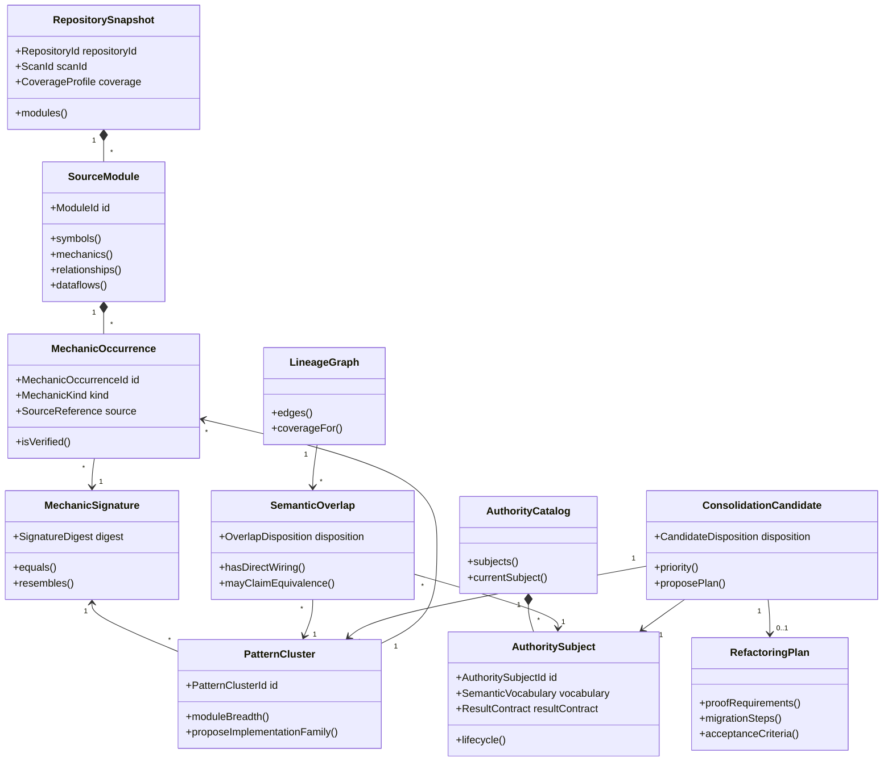

# Object-Oriented Pattern Intelligence Model

**Generated:** August 7, 2026
**Scope:** SourceFacts semantic authority, AST mechanics, repetition analysis, lineage, and consolidation planning
**Status:** Proposed target model; no authority admission or implementation change is implied

## Executive summary

The current SourceFacts data can be represented as an object-oriented domain without replacing the relational RAG plane. The relational index remains the durable observation and query surface. Objects provide a behavior-bearing interpretation layer over those facts.

The proposed model has five bounded contexts:

1. **Source observation** represents files, symbols, source references, relationships, dataflows, and executable mechanics.
2. **Semantic authority** represents declarations, authority subjects, lifecycle, obligations, results, and proof requirements.
3. **Pattern intelligence** discovers repeated mechanic signatures, exact duplicates, implementation families, and semantic overlap.
4. **Governance and lineage** distinguishes observed, proposed, admitted, current, historical, generated, and superseded evidence.
5. **Modernization planning** turns reviewed clusters into consolidation candidates and evidence-bound work plans.

This model directly addresses the analysis findings:

- 14,830 observed mechanics are represented as `MechanicOccurrence` objects rather than anonymous rows.
- Repeated shapes become `MechanicSignature` and `PatternCluster` objects.
- Candidate and draft artifacts are prevented from overwhelming admitted authority through `ArtifactLifecycle` and `CorpusPolicy`.
- The 98.99% lineage gap is represented explicitly by `AuthorityCoverage`, not inferred from string overlap.
- Repeated helpers such as `runsSqlcmdQuery`, `collectsJsonFiles`, `canonicalizesJson`, and schema validators become reviewed `ConsolidationCandidate` aggregates.

The central design rule is:

> SourceFacts owns observation, authority owns declared meaning, pattern intelligence proposes relationships, and only governance admits them.

## Evidence baseline

This design is grounded in a fresh projection and governance analysis of the repository.

| Evidence | Observed value |
|---|---:|
| Source files | 223 |
| Symbols | 11,825 |
| Relationships | 61,222 |
| Document facts | 57,399 |
| Body mechanics | 14,830 |
| Dataflows | 32,358 |
| Mechanics with canonical lineage | 0 |
| Mechanics with proposed lineage | 150 |
| Mechanics without lineage | 14,680 |
| Unknown-syntax ratio | 64.19% |

The four most common mechanics—object construction, fallback, state mutation, and branch—account for 85.9% of mechanic observations. The largest repeated mechanic shape occurs in 74 symbols across 41 modules.

Semantic mechanic names occur 983 times in indexed JSON, but 70% of those occurrences come from one candidate artifact and 17.4% from one draft. Only 2.4% occur in admitted artifacts. The object model must therefore treat lifecycle as part of evidence identity.

## Architectural position

The object model sits above the existing source-fact index and governed relational query engine.

```mermaid
flowchart LR
    Source["Source and authority artifacts"] --> Projector["SourceFacts projectors"]
    Projector --> Index["Relational source-fact index"]
    Index --> Repositories["Object repositories and mappers"]
    Repositories --> Observation["Source observation objects"]
    Repositories --> Authority["Semantic authority objects"]
    Observation --> Patterns["Pattern intelligence"]
    Authority --> Patterns
    Patterns --> Proposal["Pattern and overlap proposals"]
    Proposal --> Review["Governance review"]
    Review -->|admitted| Plan["Modernization plan"]
    Review -->|rejected or amended| Proposal
```



The index remains normalized and queryable. Objects are reconstructed for a bounded analysis request. This avoids loading the entire repository into a single mutable object graph and preserves query receipts and result hashes.

## Bounded context 1: source observation

### Core objects

| Object | Kind | Responsibility |
|---|---|---|
| `RepositorySnapshot` | Aggregate root | Identifies one immutable projection of a repository and its coverage |
| `SourceModule` | Entity | Groups symbols, mechanics, relationships, and dataflows for one file |
| `Symbol` | Entity | Represents a stable declared callable, variable, class, or parameter |
| `SourceReference` | Value object | Carries exact module, line, column, and source identity |
| `MechanicOccurrence` | Entity | Represents one AST-derived mechanic at one source location |
| `ExecutionRelationship` | Entity | Represents a dependency, invocation, containment, or other observed edge |
| `DataflowEdge` | Entity | Represents a value movement between observed bindings |
| `CoverageProfile` | Value object | Reports classified and unknown syntax without overstating completeness |

### Aggregate invariants

`RepositorySnapshot` enforces:

- every module belongs to the same repository and scan;
- every mechanic resolves to a source reference;
- every symbol-scoped mechanic refers to a symbol in the snapshot;
- duplicate occurrence identities are rejected;
- an unknown-syntax ratio above the configured threshold adds an analysis limitation;
- observations remain immutable after snapshot construction.

`MechanicOccurrence` contains observed state only:

```typescript
class MechanicOccurrence {
  constructor(
    readonly id: MechanicOccurrenceId,
    readonly kind: MechanicKind,
    readonly moduleId: ModuleId,
    readonly enclosingSymbolId: SymbolId | null,
    readonly source: SourceReference,
    readonly classification: ObservationClassification,
    readonly verification: VerificationDisposition,
  ) {}

  belongsTo(symbol: Symbol): boolean {
    return this.enclosingSymbolId?.equals(symbol.id) ?? false;
  }

  isVerified(): boolean {
    return this.verification.isEvaluated();
  }
}
```

It does not decide that a branch means a business decision or that two mechanics are semantically equivalent. Those are pattern or governance concerns.

## Bounded context 2: semantic authority

### Core objects

| Object | Kind | Responsibility |
|---|---|---|
| `AuthorityCatalog` | Aggregate root | Holds authority subjects visible to one analysis scope |
| `AuthoritySubject` | Entity | Stable identity for a declared business or execution subject |
| `SemanticDeclaration` | Entity | A concept, decision, relation, obligation, transformation, result, or policy |
| `AuthorityDocument` | Entity | Source-addressable carrier of semantic declarations |
| `ArtifactLifecycle` | Value object | Candidate, draft, admitted, historical, superseded, generated, or schema |
| `SemanticVocabulary` | Value object | Normalized concepts and mechanic terms declared by a subject |
| `ResultContract` | Value object | Declared inputs, outcomes, failures, and result shape |
| `ProofRequirement` | Value object | Evidence required before a claim may be admitted |

### Lifecycle is part of meaning

The same text has different evidentiary weight depending on its lifecycle:

```typescript
class ArtifactLifecycle {
  static candidate(): ArtifactLifecycle;
  static draft(): ArtifactLifecycle;
  static admitted(): ArtifactLifecycle;
  static historical(): ArtifactLifecycle;
  static generated(): ArtifactLifecycle;
  static schema(): ArtifactLifecycle;

  mayGovernExecution(): boolean {
    return this.value === "ADMITTED";
  }

  defaultRetrievalWeight(): number {
    return {
      ADMITTED: 1.0,
      HISTORICAL: 0.65,
      DRAFT: 0.4,
      CANDIDATE: 0.2,
      GENERATED: 0.1,
      SCHEMA: 0.05,
    }[this.value];
  }
}
```

Retrieval weight affects ranking only. It never converts a candidate into authority.

### Authority invariants

`AuthorityCatalog` enforces:

- every subject has a stable subject identity independent of its file path;
- admitted declarations identify their admission evidence;
- conflicting admitted declarations are surfaced rather than silently merged;
- successor and historical documents remain separate versions of a subject;
- generated candidates cannot govern execution;
- schemas define representation constraints but do not become business authority merely because they contain mechanic vocabulary.

## Bounded context 3: pattern intelligence

Pattern intelligence operates on observation and authority objects but owns neither.

### `MechanicSignature`

A signature is an immutable description of mechanics observed within a boundary.

```typescript
class MechanicSignature {
  static exact(occurrences: readonly MechanicOccurrence[]): MechanicSignature;
  static shape(occurrences: readonly MechanicOccurrence[]): MechanicSignature;

  constructor(
    readonly granularity: "EXACT_COUNTS" | "PRESENCE_SHAPE",
    readonly members: ReadonlyMap<MechanicKind, number>,
    readonly digest: SignatureDigest,
  ) {}

  resembles(other: MechanicSignature): SimilarityScore;
  equals(other: MechanicSignature): boolean;
}
```

Two useful projections are preserved:

- **Exact-count signature:** `branch:1|fallback:1|object-construction:1|throw:1`
- **Presence shape:** `branch|fallback|object-construction|throw`

Exact signatures find likely implementation duplication. Presence shapes find broader responsibility families.

### `PatternCluster`

```typescript
class PatternCluster {
  private readonly members = new Map<SymbolId, PatternMember>();

  constructor(
    readonly id: PatternClusterId,
    readonly signature: MechanicSignature,
    readonly evidence: EvidenceReceipt,
  ) {}

  add(member: PatternMember): void {
    if (!member.signature.equals(this.signature)) {
      throw new Error("PATTERN_SIGNATURE_MISMATCH");
    }
    this.members.set(member.symbol.id, member);
  }

  moduleBreadth(): number;
  occurrenceCount(): number;
  isCrossModule(): boolean;
  proposeImplementationFamily(): ImplementationFamilyProposal;
}
```

A cluster is evidence of repeated structure, not automatically a refactoring recommendation. A reviewer may classify it as:

- shared infrastructure;
- intentional variants;
- generated projection family;
- migration aliases;
- duplicated business responsibility;
- coincidental mechanic similarity;
- insufficient evidence.

### `SemanticOverlap`

`SemanticOverlap` keeps lexical matching, structural similarity, wiring, and admitted equivalence separate.

```typescript
class SemanticOverlap {
  constructor(
    readonly authoritySubject: AuthoritySubjectId,
    readonly implementation: SymbolId,
    readonly vocabularyScore: SimilarityScore,
    readonly mechanicScore: SimilarityScore,
    readonly resultContractScore: SimilarityScore,
    readonly wiringEvidence: readonly LineageEdge[],
    readonly disposition: OverlapDisposition,
  ) {}

  hasDirectWiring(): boolean;
  requiresHumanReview(): boolean;
  mayClaimEquivalence(): boolean {
    return this.disposition === "ADMITTED_EQUIVALENT";
  }
}
```

Proposed dispositions are:

- `NO_MATCH`;
- `LEXICAL_MATCH_ONLY`;
- `STRUCTURAL_MATCH`;
- `PARTIAL_SEMANTIC_OVERLAP`;
- `PROPOSED_EXACT_OVERLAP`;
- `CONFLICT`;
- `INSUFFICIENT_EVIDENCE`;
- `ADMITTED_EQUIVALENT`.

Only the last disposition may support an equivalence claim.

### `DuplicateArtifactGroup`

Exact file hashes should not be mixed with inferred pattern clusters.

```typescript
class DuplicateArtifactGroup {
  constructor(
    readonly contentHash: ContentHash,
    readonly artifacts: readonly ArtifactReference[],
  ) {
    if (artifacts.length < 2) throw new Error("DUPLICATE_GROUP_REQUIRES_MULTIPLE_ARTIFACTS");
  }

  classify(roleEvidence: readonly ArtifactRole[]): DuplicateDisposition;
}
```

This object can represent the three byte-identical query-console entry files and classify them as migration aliases if their surrounding authority supports that conclusion.

## Bounded context 4: governance and lineage

### Core objects

| Object | Kind | Responsibility |
|---|---|---|
| `LineageGraph` | Aggregate root | Stores deterministic and reviewed relationships between authority and execution |
| `LineageEdge` | Entity | Direct import, binding, invocation, projection, succession, or reviewed semantic relationship |
| `AuthorityCoverage` | Value object | Computes canonical, proposed, ambiguous, and missing coverage |
| `ReviewDecision` | Entity | Records approval, amendment, rejection, reviewer, and evidence |
| `EvidenceReceipt` | Value object | Binds a query, source snapshot, result hash, and analysis policy |
| `CorpusPolicy` | Value object | Controls which lifecycle classes participate in a retrieval or comparison |

### Coverage is derived from lineage

```typescript
class AuthorityCoverage {
  static evaluate(
    mechanics: readonly MechanicOccurrence[],
    lineage: LineageGraph,
  ): AuthorityCoverage;

  canonicalCount(): number;
  proposedCount(): number;
  ambiguousCount(): number;
  missingCount(): number;
  ratio(disposition: CoverageDisposition): number;
}
```

String equality between a mechanic name in JSON and an AST mechanic is retrieval evidence. It is not lineage. This prevents 983 semantic mentions from being misreported as 983 governed bindings.

### Lifecycle-aware retrieval

```typescript
class CorpusPolicy {
  constructor(
    readonly includedLifecycles: ReadonlySet<ArtifactLifecycle>,
    readonly aliasPolicy: "COLLAPSE" | "RETAIN",
    readonly generatedPolicy: "EXCLUDE" | "DOWNRANK" | "RETAIN",
  ) {}

  admits(document: AuthorityDocument): boolean;
  weight(document: AuthorityDocument): number;
}
```

Recommended policies:

| Query purpose | Lifecycle policy |
|---|---|
| Current governing meaning | Admitted current authority only |
| Candidate discovery | Admitted + draft + candidate, with lifecycle weighting |
| Historical reconciliation | Current + historical + succession edges |
| Representation/schema search | Schemas retained but explicitly labeled |
| Duplication analysis | Generated and alias artifacts collapsed by default |

## Bounded context 5: modernization planning

### `ConsolidationCandidate`

```typescript
class ConsolidationCandidate {
  constructor(
    readonly id: CandidateId,
    readonly cluster: PatternCluster,
    readonly semanticRole: SemanticRole | null,
    readonly disposition: CandidateDisposition,
    readonly risks: readonly TransformationRisk[],
    readonly proofRequirements: readonly ProofRequirement[],
  ) {}

  priority(): PriorityScore {
    return PriorityScore.from({
      recurrence: this.cluster.memberCount(),
      moduleBreadth: this.cluster.moduleBreadth(),
      confidence: this.disposition.confidence(),
      authorityCoverage: this.semanticRole?.coverage() ?? 0,
      transformationRisk: TransformationRisk.total(this.risks),
    });
  }

  proposePlan(): RefactoringPlan {
    if (!this.disposition.isReviewed()) {
      throw new Error("REVIEW_REQUIRED_BEFORE_PLANNING");
    }
    return RefactoringPlan.forCandidate(this);
  }
}
```

Priority is advisory. High recurrence does not override transformation risk or missing authority.

### `RefactoringPlan`

A plan contains:

- reviewed responsibility;
- source members;
- proposed shared abstraction;
- preserved variants;
- authority changes, if any;
- dependency migration order;
- characterization tests;
- equivalence or conformance vectors;
- rollback boundary;
- acceptance criteria;
- final source-fact and lineage re-projection.

### Initial candidate portfolio

| Candidate | Evidence | Likely object-oriented destination | Required review |
|---|---|---|---|
| SQL command execution | Six `runsSqlcmdQuery` implementations with the same exact mechanic signature | `SqlCommandExecutor` infrastructure service with request/result value objects | Confirm connection, temporary-file, encoding, and cleanup policies are truly shared |
| JSON artifact discovery | Five `collectsJsonFiles` implementations with the same signature | `JsonArtifactRepository` plus lifecycle-specific predicates | Confirm directory-error and ordering semantics |
| Canonical JSON | Four repeated canonicalization implementations | `CanonicalJsonSerializer` domain service | Bind canonicalization rules and hash compatibility vectors |
| Schema validation | Repeated loader and `validatesAgainst` shapes | `SchemaRegistry` and `ArtifactValidator` services | Preserve schema scope, labels, and error formatting |
| Query-console aliases | Three byte-identical modules | `ExecutableAliasSet` or one canonical implementation with explicit successor aliases | Confirm migration and runtime entry-point requirements |
| Dominant projection shape | 74 symbols across 41 modules | `ProjectionOperation` family only after semantic subclustering | Broad mechanic similarity alone is insufficient |

## Object relationships



## Application services

Domain objects should not perform repository-wide orchestration. Application services coordinate bounded operations.

### `PatternAnalysisService`

Inputs:

- repository snapshot identity;
- symbol or module boundary;
- signature granularity;
- corpus policy;
- minimum occurrence and module breadth.

Outputs:

- pattern clusters;
- exact duplicate groups;
- query and result receipts;
- coverage limitations.

### `SemanticBridgeService`

Inputs:

- reviewed pattern cluster;
- authority subject candidates;
- vocabulary, mechanic, result-contract, and wiring evidence.

Outputs:

- one or more `SemanticOverlap` proposals;
- conflicts and missing evidence;
- no admitted mutation.

### `ConsolidationPlanningService`

Inputs:

- reviewed implementation family;
- admitted or explicitly missing authority;
- dependency graph;
- proof requirements.

Outputs:

- ordered refactoring plan;
- shared abstraction proposal;
- preserved variant list;
- characterization and conformance work.

### `LifecycleAwareRetrievalService`

Inputs:

- natural-language or structured query;
- corpus policy;
- repository snapshot.

Outputs:

- ranked results with lifecycle, evidence class, alias group, and source receipt;
- admitted and inferred results displayed separately.

## Repository interfaces

Repositories adapt the relational RAG plane to bounded object graphs.

```typescript
interface MechanicRepository {
  findBySnapshotAndScope(
    snapshotId: SnapshotId,
    scope: AnalysisScope,
  ): Promise<readonly MechanicOccurrence[]>;

  findSignatureMembers(
    snapshotId: SnapshotId,
    signature: MechanicSignature,
  ): Promise<readonly PatternMember[]>;
}

interface AuthorityRepository {
  findSubjects(
    policy: CorpusPolicy,
    vocabulary: SemanticVocabulary,
  ): Promise<readonly AuthoritySubject[]>;
}

interface LineageRepository {
  loadGraph(snapshotId: SnapshotId): Promise<LineageGraph>;
  saveProposal(proposal: SemanticOverlapProposal): Promise<EvidenceReceipt>;
  saveReview(decision: ReviewDecision): Promise<EvidenceReceipt>;
}
```

Implementations issue governed relational queries rather than walking raw JSON arrays repeatedly. Each reconstruction retains the query receipt, source index identifier, and result hash.

## Mapping the existing index to objects

| Current collection or report surface | Object-oriented representation |
|---|---|
| `files` | `SourceModule` identity and module summary |
| `symbols` | `Symbol` entities |
| `sourceReferences` | `SourceReference` value objects |
| `relationships` | `ExecutionRelationship` entities |
| `bodyMechanics` | `MechanicOccurrence` entities |
| `dataflows` | `DataflowEdge` entities |
| `documents` | `AuthorityDocument` and `SemanticDeclaration` inputs |
| `coverage` | `CoverageProfile` |
| Feature coverage summary | `AuthorityCoverage` |
| Authority succession | `LineageGraph` succession edges |
| Semantic-overlap proposals | `SemanticOverlapProposal` entities |
| Query receipt hashes | `EvidenceReceipt` value objects |

No current collection needs to be discarded. The object layer gives the rows identity, behavior, invariants, and a bounded lifecycle.

## How the model addresses the next moves

| Next move | Object-oriented mechanism | Result |
|---|---|---|
| Consolidate repeated infrastructure | `PatternCluster` → reviewed `ConsolidationCandidate` → `RefactoringPlan` | Repetition becomes an evidence-bound portfolio rather than an ad hoc search result |
| Prevent candidates from dominating retrieval | `ArtifactLifecycle`, `CorpusPolicy`, and `ExecutableAliasSet` | Admitted, draft, generated, schema, and alias evidence remain distinguishable |
| Add reusable mechanic signatures | `MechanicSignature`, `PatternMember`, and `PatternCluster` | Exact and broad shapes become stable queryable objects |
| Bridge clusters to authority in batches | `SemanticBridgeService` and `SemanticOverlap` | One reviewed responsibility can cover a family without claiming automatic equivalence |
| Respect incomplete AST coverage | `CoverageProfile` and `EvidenceReceipt` | Every conclusion carries the 64.19% unknown-syntax limitation until coverage improves |

## Suggested implementation sequence

### Phase 1: value objects and lifecycle policy

Implement:

- typed identifiers;
- `SourceReference`;
- `MechanicKind`;
- `ArtifactLifecycle`;
- `CorpusPolicy`;
- `CoverageProfile`;
- `EvidenceReceipt`.

Acceptance criteria:

- no change to current index serialization;
- lifecycle classification is deterministic and tested;
- default retrieval can exclude or down-rank candidates, drafts, schemas, generated artifacts, and aliases;
- all object reconstruction is bound to a query receipt.

### Phase 2: signatures and clusters

Implement:

- `MechanicSignature`;
- `PatternMember`;
- `PatternCluster`;
- `DuplicateArtifactGroup`;
- `PatternAnalysisService`.

Acceptance criteria:

- the current 74-symbol dominant shape is reproduced;
- the six SQL runner, five JSON discovery, and four canonicalization families are recoverable;
- exact duplicate files remain separate from inferred similarity;
- cluster identities are deterministic for the same snapshot and policy.

### Phase 3: authority and lineage bridge

Implement:

- `AuthoritySubject`;
- `SemanticDeclaration`;
- `LineageGraph`;
- `AuthorityCoverage`;
- `SemanticOverlap`;
- `SemanticBridgeService`.

Acceptance criteria:

- lexical matches do not count as canonical lineage;
- the current result remains 0 canonical, 150 proposed, and 14,680 missing mechanics unless reviewed authority changes;
- conflicts and insufficient evidence are first-class outcomes;
- review decisions are append-only and receipt-bound.

### Phase 4: consolidation portfolio

Implement:

- `ImplementationFamilyProposal`;
- `ReviewDecision`;
- `ConsolidationCandidate`;
- `PriorityScore`;
- `RefactoringPlan`;
- `ConsolidationPlanningService`.

Acceptance criteria:

- repeated infrastructure families receive reviewed dispositions;
- migration aliases are not proposed as ordinary duplication;
- no source rewrite is proposed without proof requirements and rollback boundaries;
- a new SourceFacts projection can compare before-and-after mechanic, lineage, and coverage state.

### Phase 5: parser coverage improvement

Use `CoverageProfile` to prioritize unsupported syntax families by frequency and downstream analytical impact.

Acceptance criteria:

- parser improvements use fixed source fixtures and mutation controls;
- the unknown-syntax ratio is reported per module and syntax family;
- historical reports remain reproducible against their original analyzer version;
- no previous inference is silently upgraded after parser changes.

## Package layout proposal

```text
src/
  domain/
    observation/
      repository-snapshot.js
      source-module.js
      mechanic-occurrence.js
      source-reference.js
      coverage-profile.js
    authority/
      authority-catalog.js
      authority-subject.js
      semantic-declaration.js
      artifact-lifecycle.js
      result-contract.js
    patterns/
      mechanic-signature.js
      pattern-cluster.js
      duplicate-artifact-group.js
      semantic-overlap.js
    governance/
      lineage-graph.js
      authority-coverage.js
      review-decision.js
      evidence-receipt.js
      corpus-policy.js
    modernization/
      consolidation-candidate.js
      priority-score.js
      refactoring-plan.js
  application/
    analyze-patterns.js
    bridge-semantics.js
    plan-consolidation.js
    retrieve-lifecycle-aware-evidence.js
  infrastructure/
    source-facts/
      relational-mechanic-repository.js
      relational-authority-repository.js
      relational-lineage-repository.js
```

The names describe ownership, not a mandate to move all existing modules immediately. New behavior can be introduced behind adapters and then adopted one use case at a time.

## Testing model

Each layer needs a distinct proof style.

| Layer | Required proof |
|---|---|
| Value objects | Constructor invariants, equality, canonical serialization |
| Aggregates | State transitions and rejected invalid operations |
| Repository adapters | Query-plan and row-to-object reconstruction receipts |
| Pattern services | Fixed cluster fixtures, negative similarity controls, deterministic digests |
| Semantic bridge | Exact, partial, conflict, no-match, and insufficient-evidence vectors |
| Governance | Append-only review lineage and lifecycle enforcement |
| Modernization planning | Dependency ordering, preserved variants, rollback, and acceptance criteria |
| Parser coverage | Syntax fixtures, mutation controls, and before/after coverage comparison |

The highest-risk negative control is essential:

> Two symbols with the same mechanic signature but different result contracts must not be admitted as semantically equivalent.

## Decision boundaries

The following claims remain intentionally separate:

| Claim | Owner | Automation level |
|---|---|---|
| These mechanics occurred at these locations | Source observation | Deterministic |
| These symbols share an exact mechanic signature | Pattern intelligence | Deterministic |
| These symbols may implement the same responsibility | Pattern intelligence | Proposed |
| This authority is wired to this implementation | Lineage graph | Deterministic when explicit; otherwise proposed |
| This implementation is semantically equivalent to the authority | Governance review | Admitted only after review and proof |
| These implementations should be consolidated | Modernization review | Reviewed proposal |
| This shared abstraction may replace them safely | Refactoring proof | Proven through tests and vectors |

## Final recommendation

Begin with `ArtifactLifecycle`, `CorpusPolicy`, `MechanicSignature`, and `PatternCluster`. They address the two biggest analytical problems immediately:

1. candidate and draft repetition currently distorts semantic retrieval; and
2. repeated AST mechanics are visible but lack stable domain identity.

Then use the SQL runner and JSON discovery families as the first end-to-end modernization cases. They are bounded, cross-module, structurally repetitive, and infrastructure-oriented. They can prove the object model and review workflow before applying it to the much broader 74-symbol projection shape.

This approach preserves SourceFacts as the evidence plane while adding an object-oriented decision plane that can explain, review, and safely act on recurring business and implementation patterns.
