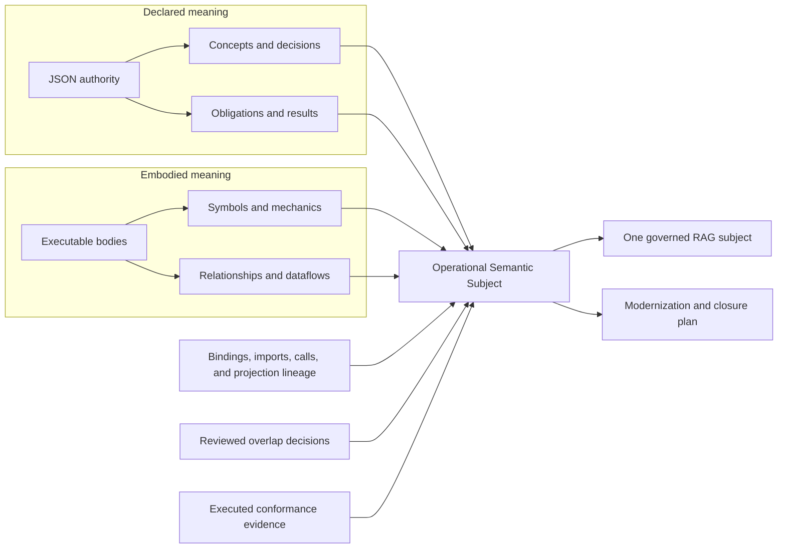
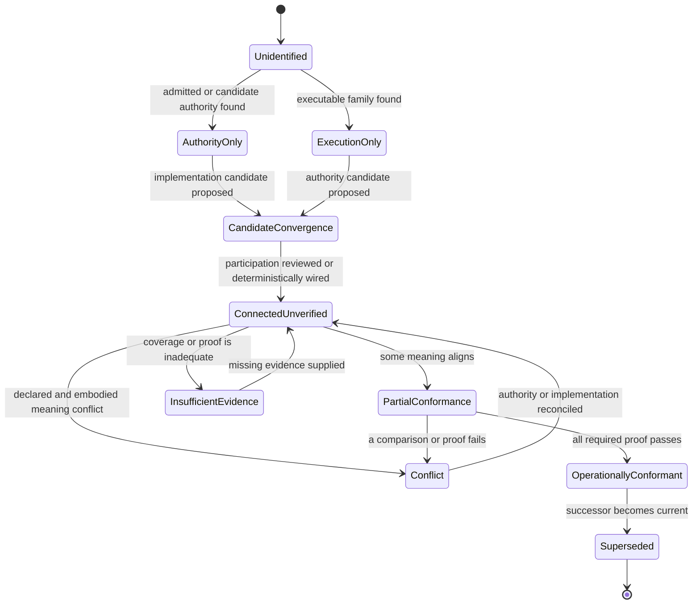
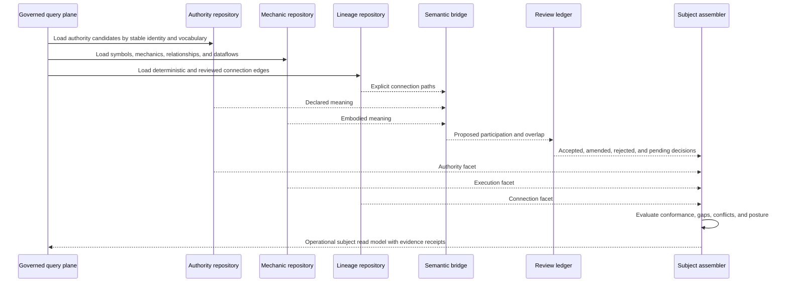
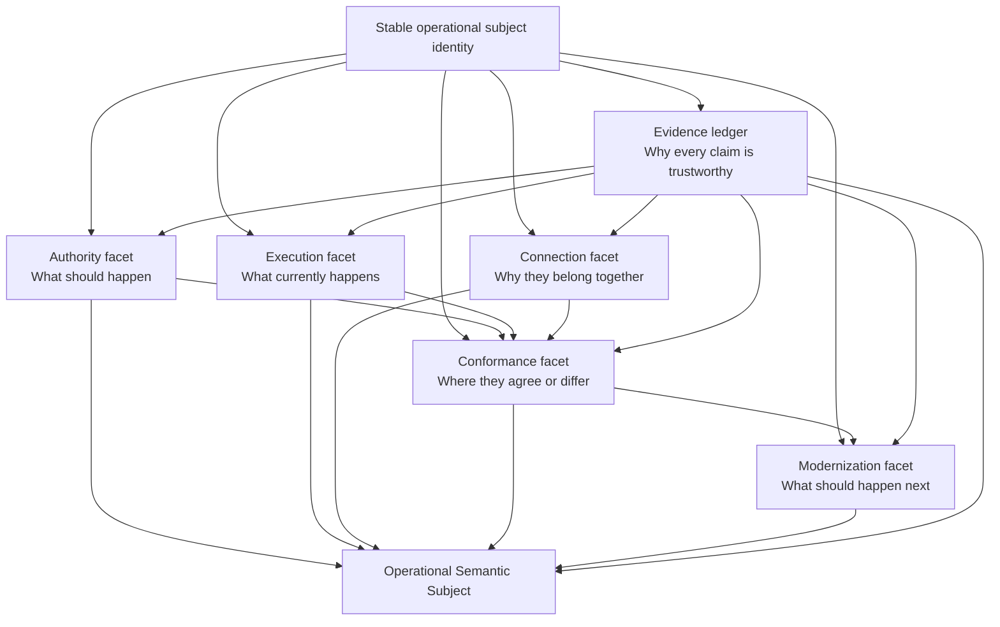

# Operational Semantic Subject Convergence Model

**Generated:** August 7, 2026
**Scope:** Convergence of declared JSON authority and observed executable meaning
**Status:** Proposed domain specification; it does not admit semantic equivalence or modify executable authority

## Purpose

SourceFacts currently exposes two independently valuable bodies of evidence:

1. JSON authority declares concepts, decisions, obligations, transformations, results, failure policies, and proof requirements.
2. Executable bodies expose symbols, relationships, dataflows, mechanics, effects, and result construction.

The two should come together as one operationally useful subject without losing the distinction between:

- what was declared;
- what was observed;
- how the two are connected;
- what was inferred;
- what a reviewer admitted; and
- what proof has actually executed.

This document defines that convergence.

The unifying aggregate is:

> **`OperationalSemanticSubject` — one stable semantic identity with independently sourced authority, execution, connection, conformance, and modernization facets.**

“One” means one governed subject and query surface. It does not mean flattening authority and execution into an indistinguishable set of facts.

## Convergence at a glance



The aggregate answers, in one place:

- What is this subject?
- What meaning is declared for it?
- Which executable bodies embody or support it?
- What deterministic evidence connects them?
- Where do their meanings overlap, diverge, or remain unknown?
- What proof exists?
- What is still missing?
- What action, if any, is safe to propose?

## Aggregate root

```typescript
class OperationalSemanticSubject {
  private constructor(
    readonly id: OperationalSubjectId,
    readonly identity: SubjectIdentity,
    readonly authority: AuthorityFacet,
    readonly execution: ExecutionFacet,
    readonly connection: ConnectionFacet,
    readonly conformance: ConformanceFacet,
    readonly modernization: ModernizationFacet,
    readonly evidence: SubjectEvidenceLedger,
    readonly version: SubjectVersion,
  ) {}

  static assemble(input: SubjectAssemblyInput): OperationalSemanticSubject;

  posture(): OperationalPosture;
  gaps(): readonly SubjectGap[];
  conflicts(): readonly SemanticConflict[];
  currentImplementations(): readonly ExecutableImplementation[];
  mayClaimOperationalConformance(): boolean;
  proposeClosurePlan(): SubjectClosureProposal;
  projectReadModel(): OperationalSubjectReadModel;
}
```

The aggregate is reconstructed from durable facts and reviewed decisions. It does not own source code or authority documents. It owns the governed interpretation of how those artifacts participate in one subject.

## The six facets

### 1. `SubjectIdentity`

`SubjectIdentity` establishes the stable concept that survives file moves, implementation replacement, authority succession, and projection changes.

```typescript
class SubjectIdentity {
  constructor(
    readonly subjectId: OperationalSubjectId,
    readonly canonicalName: CanonicalName,
    readonly subjectKind: SubjectKind,
    readonly aliases: readonly SubjectAlias[],
    readonly namespace: SubjectNamespace,
  ) {}

  recognizes(candidate: SubjectReference): boolean;
}
```

Possible subject kinds include:

- capability;
- responsibility;
- obligation;
- decision;
- transformation;
- projection;
- result contract;
- failure policy;
- shared infrastructure service.

#### Identity rules

- A subject ID is not derived solely from a file path or symbol name.
- Moving an implementation does not create a new semantic subject.
- Replacing an implementation does not erase the historical implementation.
- Multiple bodies may participate in one subject.
- One body may support multiple subjects only through explicit, separately evidenced participation.
- Lexical similarity may propose an alias but cannot establish subject identity.
- Authority succession changes versions or documents, not necessarily the subject ID.

### 2. `AuthorityFacet`

The authority facet contains declared meaning.

```typescript
class AuthorityFacet {
  constructor(
    readonly subjectId: OperationalSubjectId,
    readonly current: AuthorityVersion | null,
    readonly historical: readonly AuthorityVersion[],
    readonly candidates: readonly AuthorityVersion[],
    readonly declarations: readonly SemanticDeclaration[],
    readonly resultContract: ResultContract | null,
    readonly proofRequirements: readonly ProofRequirement[],
  ) {}

  hasAdmittedAuthority(): boolean;
  unresolvedDeclarations(): readonly SemanticDeclaration[];
  conflicts(): readonly AuthorityConflict[];
}
```

An `AuthorityVersion` preserves:

- source document and JSON pointers;
- content digest;
- lifecycle;
- admission or review receipt;
- effective and supersession information;
- concepts, decisions, relations, obligations, and results;
- projection and execution expectations.

The facet may legitimately be empty. Execution-only subjects remain representable.

### 3. `ExecutionFacet`

The execution facet contains observed executable participation.

```typescript
class ExecutionFacet {
  constructor(
    readonly subjectId: OperationalSubjectId,
    readonly implementations: readonly ExecutableImplementation[],
    readonly supportingBodies: readonly ExecutableImplementation[],
    readonly aliases: readonly ExecutableAliasSet[],
    readonly snapshot: RepositorySnapshotReference,
    readonly coverage: CoverageProfile,
  ) {}

  current(): readonly ExecutableImplementation[];
  mechanicInventory(): MechanicInventory;
  implementationFamilies(): readonly ImplementationFamily[];
}
```

Each `ExecutableImplementation` contains:

- symbol and module identity;
- source references;
- mechanic occurrences;
- relationships;
- dataflow edges;
- effects and result construction that were actually observed;
- implementation lifecycle such as current, historical, generated, projected, alias, or test-only;
- the repository snapshot and analyzer version.

The facet does not claim that mechanics express the declared business meaning. It reports embodied evidence.

### 4. `ConnectionFacet`

The connection facet explains why authority and execution appear in the same aggregate.

```typescript
class ConnectionFacet {
  constructor(
    readonly deterministicEdges: readonly ConnectionEdge[],
    readonly reviewedEdges: readonly ConnectionEdge[],
    readonly proposedEdges: readonly ConnectionEdge[],
    readonly rejectedEdges: readonly ConnectionEdge[],
  ) {}

  strongestConnection(): ConnectionStrength;
  directBindings(): readonly ConnectionEdge[];
  transitivePaths(): readonly ConnectionPath[];
  proposalsAwaitingReview(): readonly ConnectionEdge[];
}
```

Connection edge kinds include:

- authority binding;
- direct import;
- runtime invocation;
- adapter delegation;
- projection lineage;
- source-document reference;
- contract artifact ownership;
- authority succession;
- reviewed semantic participation;
- inferred candidate participation.

Every edge has an evidence class:

| Evidence class | Meaning |
|---|---|
| `DETERMINISTIC` | Explicit import, binding, invocation, projection receipt, or source-addressable reference |
| `REVIEWED` | A reviewer accepted or amended the proposed relationship |
| `INFERRED` | Pattern, vocabulary, or result-shape evidence proposes a relationship |
| `REJECTED` | A reviewed proposal was found not to represent participation |

Deterministic wiring proves connection, not semantic equivalence.

### 5. `ConformanceFacet`

The conformance facet compares declared and embodied meaning without merging them.

```typescript
class ConformanceFacet {
  constructor(
    readonly comparisons: readonly SemanticComparison[],
    readonly proofExecutions: readonly ProofExecution[],
    readonly coverage: AuthorityCoverage,
    readonly conflicts: readonly SemanticConflict[],
    readonly posture: ConformancePosture,
  ) {}

  exactOverlaps(): readonly SemanticComparison[];
  partialOverlaps(): readonly SemanticComparison[];
  missingInExecution(): readonly DeclaredMeaning[];
  undeclaredInAuthority(): readonly EmbodiedMeaning[];
  mayClaimEquivalence(): boolean;
}
```

The comparison preserves four primary sets:

```text
Declared meaning ∩ Embodied meaning
    = reviewed overlap

Declared meaning − Embodied meaning
    = declared but not observed

Embodied meaning − Declared meaning
    = observed but undeclared

Declared meaning conflicting with Embodied meaning
    = semantic conflict
```

An exact lexical or mechanic match is insufficient for conformance. Conformance may require:

- compatible input meaning;
- equivalent decision alternatives;
- aligned result identities;
- matching failure policies;
- compatible side effects;
- ordering and cardinality agreement;
- executed positive vectors;
- executed boundary and negative controls.

### 6. `ModernizationFacet`

The modernization facet contains safe next actions derived from the other facets.

```typescript
class ModernizationFacet {
  constructor(
    readonly gaps: readonly SubjectGap[],
    readonly consolidationCandidates: readonly ConsolidationCandidate[],
    readonly closureProposals: readonly SubjectClosureProposal[],
    readonly approvedPlans: readonly RefactoringPlan[],
  ) {}

  nextSafeAction(): ModernizationAction;
  unresolvedHumanDecisions(): readonly HumanDecision[];
  proofStillRequired(): readonly ProofRequirement[];
}
```

Possible actions include:

- author missing authority;
- reconcile authority succession;
- review a proposed semantic participation edge;
- create or repair a deterministic binding;
- add conformance vectors;
- preserve an intentional implementation variant;
- consolidate duplicated infrastructure;
- retire a migration alias;
- replace duplicated body meaning with authority-driven execution;
- abstain because evidence coverage is insufficient.

## Evidence ledger

Every part of the aggregate must retain provenance.

```typescript
class SubjectEvidenceLedger {
  constructor(
    readonly sourceSnapshot: RepositorySnapshotReference,
    readonly queryReceipts: readonly EvidenceReceipt[],
    readonly authorityReceipts: readonly EvidenceReceipt[],
    readonly reviewReceipts: readonly EvidenceReceipt[],
    readonly proofReceipts: readonly EvidenceReceipt[],
  ) {}

  verifies(): EvidenceVerificationResult;
}
```

The ledger prevents a convenient object graph from becoming an untraceable interpretation.

Each evidence reference identifies:

- source artifact;
- source pointer or source location;
- source digest;
- repository snapshot;
- analyzer and version;
- query text or registered query identity;
- input and result hashes;
- lifecycle at observation time;
- inference or admission status.

## Operational posture

The aggregate computes one posture from the independent facets.



### Posture vocabulary

| Posture | Meaning |
|---|---|
| `UNIDENTIFIED` | Facts exist but no stable operational subject has been established |
| `AUTHORITY_ONLY` | Declared meaning exists without an accepted executable participant |
| `EXECUTION_ONLY` | Executable meaning exists without accepted authority |
| `CANDIDATE_CONVERGENCE` | One or more cross-graph relationships are proposed |
| `CONNECTED_UNVERIFIED` | Connection is accepted or deterministic, but semantic conformance is unproved |
| `PARTIAL_CONFORMANCE` | Reviewed overlap exists alongside gaps |
| `CONFLICT` | Declared and embodied meaning disagree materially |
| `INSUFFICIENT_EVIDENCE` | Coverage or proof cannot support a reliable conclusion |
| `OPERATIONALLY_CONFORMANT` | Required connections, comparisons, and proof are satisfied |
| `SUPERSEDED` | The subject version or implementation is historical but remains traceable |

## Aggregate invariants

`OperationalSemanticSubject` enforces the following rules.

### Identity invariants

1. The aggregate has exactly one stable operational subject ID.
2. Every authority version and executable participation points to that subject through evidence.
3. Candidate name or vocabulary matches cannot silently create identity.
4. Aliases retain their own artifact identities while resolving to one operational subject.

### Authority invariants

5. At most one admitted authority version is current for a given effective context.
6. Candidate and draft authority remain non-governing.
7. Conflicting admitted declarations are visible and prevent a conformant posture.
8. Schema vocabulary does not become business authority without an authority declaration.

### Execution invariants

9. Every implementation is bound to a repository snapshot and source digest.
10. Generated, alias, test-only, current, and historical bodies remain distinguishable.
11. Exact file duplicates are represented as an alias or duplicate group, not multiplied into independent semantic evidence by default.
12. Unknown syntax remains an explicit coverage limitation.

### Connection invariants

13. Every authority-to-execution relationship declares its evidence class.
14. Inference cannot be upgraded to review or admission without a receipt.
15. Deterministic wiring does not imply semantic equivalence.
16. Rejected participation edges remain discoverable to prevent repeated false proposals.

### Conformance invariants

17. Lexical overlap alone cannot establish conformance.
18. Mechanic-signature equality alone cannot establish conformance.
19. A conformant posture requires every mandatory proof requirement to pass.
20. Partial and conflicting meaning cannot be hidden by an aggregate score.
21. Proof is version-bound to both authority and executable evidence.

### Modernization invariants

22. A consolidation proposal must identify preserved variants and transformation risks.
23. No refactoring plan may claim semantic safety without characterization or conformance evidence.
24. Closing a gap must produce a new projection and evidence receipt.
25. The aggregate is append-only with respect to historical evidence and review decisions.

## Assembly process

Convergence is a staged operation, not a constructor that accepts arbitrary JSON.



### Stage 1: identify a candidate subject

A subject may begin from:

- an admitted authority subject ID;
- a canonical feature, scenario, responsibility, or obligation;
- a bound runtime authority;
- a repeated implementation family;
- an execution entry point;
- a historical subject requiring reconciliation.

The initial identity is established only from a canonical identifier or through review.

### Stage 2: hydrate authority independently

Load:

- current admitted authority;
- historical and successor authority;
- drafts and candidates under the selected corpus policy;
- result contracts;
- proof requirements;
- authority conflicts.

No executable body is required.

### Stage 3: hydrate execution independently

Load:

- current and historical symbols;
- mechanic occurrences;
- relationships;
- dataflows;
- effects;
- result construction;
- exact duplicates and alias groups;
- parser coverage.

No JSON authority is required.

### Stage 4: resolve deterministic connections

Resolve direct and transitive evidence:

- imports;
- bindings;
- runtime calls;
- adapters;
- projection receipts;
- declared source paths;
- authority succession;
- reviewed implementation ownership.

The aggregate may now reach `CONNECTED_UNVERIFIED`, but not semantic conformance.

### Stage 5: propose semantic participation

For unconnected evidence, compare:

- normalized vocabulary;
- mechanic signatures;
- enclosing responsibility;
- input and result shapes;
- failure behavior;
- side effects;
- call-graph neighborhood;
- existing rejected proposals.

The output is a proposal with evidence, confidence dimensions, and abstention conditions.

### Stage 6: review the bridge

A reviewer may:

- accept participation;
- accept only supporting participation;
- split one implementation across multiple subjects;
- merge duplicate subject candidates;
- reject coincidental similarity;
- request more evidence;
- amend the semantic comparison.

The decision becomes a durable lineage edge.

### Stage 7: evaluate conformance

Compare declared and embodied meaning dimension by dimension. Execute required proof vectors where available. Produce exact overlaps, partial overlaps, gaps, conflicts, and proof failures.

### Stage 8: materialize the unified subject

Project one read model with:

- one subject identity;
- separate declared and observed facets;
- explicit bridge evidence;
- current posture;
- gaps and conflicts;
- modernization candidates;
- complete provenance.

## Commands and domain events

### Commands

| Command | Purpose |
|---|---|
| `IdentifyOperationalSubject` | Establish or select the stable subject identity |
| `AttachAuthorityVersion` | Add a lifecycle-qualified authority version |
| `AttachExecutableParticipation` | Add a source-addressable executable participant |
| `ProposeParticipationEdge` | Suggest that execution implements or supports the subject |
| `ReviewParticipationEdge` | Accept, amend, reject, or defer the proposal |
| `RecordSemanticComparison` | Preserve exact, partial, conflicting, or insufficient overlap |
| `RecordProofExecution` | Bind a test or conformance result to the subject version |
| `ProposeSubjectClosure` | Create an evidence-bound gap-closure proposal |
| `ApproveRefactoringPlan` | Authorize a bounded modernization plan |
| `SupersedeSubjectVersion` | Preserve history while selecting a successor |

### Domain events

| Event | Meaning |
|---|---|
| `OperationalSubjectIdentified` | Stable subject identity was established |
| `AuthorityVersionAttached` | Declared meaning became visible to the subject |
| `ExecutableParticipationObserved` | An implementation or supporting body was attached |
| `ParticipationProposed` | Cross-graph participation was inferred |
| `ParticipationReviewed` | A human or governed review resolved the proposal |
| `SemanticGapDetected` | Declared or embodied meaning lacks a counterpart |
| `SemanticConflictDetected` | Declared and embodied meaning disagree |
| `ConformanceProofRecorded` | Version-bound proof executed |
| `OperationalConformanceEstablished` | All required invariants and proof passed |
| `SubjectClosureProposed` | A modernization or authoring action was proposed |
| `SubjectVersionSuperseded` | A successor became current |

## Persistence model

The aggregate is not stored as one opaque document. Durable normalized facts remain queryable.

### Proposed logical collections

| Collection | Key fields |
|---|---|
| `operationalSubjects` | `subjectId`, canonical name, kind, namespace |
| `subjectAliases` | `subjectId`, alias, alias kind, evidence |
| `subjectAuthorityVersions` | `subjectId`, authority document, lifecycle, digest, effective state |
| `subjectSemanticDeclarations` | `subjectId`, authority version, declaration kind, pointer |
| `subjectImplementations` | `subjectId`, symbol, module, snapshot, implementation lifecycle |
| `subjectConnectionEdges` | `subjectId`, source, target, edge kind, evidence class, disposition |
| `subjectSemanticComparisons` | `subjectId`, authority element, execution evidence, disposition |
| `subjectProofExecutions` | `subjectId`, authority version, implementation version, vector, result |
| `subjectGaps` | `subjectId`, gap kind, evidence, state |
| `subjectModernizationCandidates` | `subjectId`, cluster, disposition, priority, proof requirements |
| `subjectReviewDecisions` | proposal, reviewer, decision, amendments, receipt |

### Existing SourceFacts collections remain authoritative for observation

| Existing collection | Convergence use |
|---|---|
| `files` | Module identity and exact content duplicates |
| `symbols` | Executable participant identity |
| `sourceReferences` | Exact source evidence |
| `relationships` | Deterministic execution and dependency edges |
| `bodyMechanics` | Embodied mechanic inventory |
| `dataflows` | Value movement and result-shape evidence |
| `documents` | Authority-document scalar and pointer evidence |
| Governance report surfaces | Feature, scenario, responsibility, authority, and review lineage |

The new collections record subject participation and reviewed interpretation. They do not duplicate the raw AST or JSON fact stores.

## Unified JSON read model

The RAG system may project the aggregate as a single read model:

```json
{
  "documentKind": "operational-semantic-subject.v1",
  "subjectId": "canonical-json-serialization.v1",
  "identity": {
    "canonicalName": "Canonical JSON serialization",
    "subjectKind": "shared-infrastructure-service",
    "aliases": ["canonicalizesJson"]
  },
  "posture": "CANDIDATE_CONVERGENCE",
  "authority": {
    "currentAdmittedAuthority": null,
    "candidateAuthority": [],
    "declaredMeaning": [],
    "resultContract": null,
    "proofRequirements": []
  },
  "execution": {
    "implementationFamily": {
      "signature": "branch:2|fallback:1|normalization:1|serialization:2",
      "memberCount": 4,
      "moduleCount": 4
    },
    "implementations": [
      "src/composition/projects-sign-in-composition.js#function:canonicalizesJson",
      "src/gallery/captures-browser-render.js#function:canonicalizesJson",
      "src/gallery/projects-gallery.js#function:canonicalizesJson",
      "src/web/inventory.js#function:canonicalizesJson"
    ]
  },
  "connection": {
    "deterministicEdges": [],
    "reviewedEdges": [],
    "proposedEdges": [
      {
        "edgeKind": "candidate-shared-responsibility",
        "evidenceClass": "INFERRED"
      }
    ]
  },
  "conformance": {
    "posture": "NOT_EVALUATED",
    "overlap": [],
    "gaps": [
      "ADMITTED_AUTHORITY_MISSING",
      "RESULT_CONTRACT_NOT_COMPARED",
      "EQUIVALENCE_PROOF_MISSING"
    ],
    "conflicts": []
  },
  "modernization": {
    "nextSafeAction": "REVIEW_IMPLEMENTATION_FAMILY",
    "refactoringAuthorized": false
  },
  "evidence": {
    "sourceSnapshot": "sha256:...",
    "queryReceipts": ["sha256:..."]
  }
}
```

This is one subject document, but each claim still identifies whether it came from authority, execution, deterministic connection, inference, review, or proof.

## RAG query behavior

The unified subject becomes the primary retrieval unit for questions that span business and implementation meaning.

### Example queries

#### “Where is canonical JSON serialization implemented?”

Return:

- the operational subject;
- all current executable participants;
- mechanic signature and module breadth;
- connection disposition;
- missing admitted authority;
- source references.

Do not return four unrelated function matches without their shared candidate subject.

#### “Which declared obligations have no executable body?”

Filter subjects where:

```text
authority.hasAdmittedAuthority = true
AND execution.currentImplementations = 0
```

#### “Which executable responsibilities have no authority?”

Filter subjects where:

```text
execution.currentImplementations > 0
AND authority.hasAdmittedAuthority = false
```

#### “Which subjects are connected but not proven?”

Filter subjects where posture is:

- `CONNECTED_UNVERIFIED`;
- `PARTIAL_CONFORMANCE`;
- `INSUFFICIENT_EVIDENCE`.

#### “What can safely be consolidated?”

Return only reviewed consolidation candidates, their preserved variants, proof requirements, risks, and approved plan state. Repeated signatures alone are not sufficient.

### Ranking

Rank dimensions remain visible:

- authority lifecycle;
- deterministic connection strength;
- reviewed participation;
- vocabulary similarity;
- mechanic similarity;
- result-contract similarity;
- proof state;
- source coverage;
- recency and subject version.

No composite score may hide a conflict or missing mandatory proof.

## Worked repository example: canonical JSON serialization

The prior analysis found four functions with the exact mechanic signature:

```text
branch:2
fallback:1
normalization:1
serialization:2
```

Observed participants:

- `src/composition/projects-sign-in-composition.js#function:canonicalizesJson`
- `src/gallery/captures-browser-render.js#function:canonicalizesJson`
- `src/gallery/projects-gallery.js#function:canonicalizesJson`
- `src/web/inventory.js#function:canonicalizesJson`

### Execution facet

The execution facet can deterministically establish:

- four symbols exist;
- they span four modules;
- they have the same exact mechanic signature;
- they perform normalization and serialization mechanics;
- their source references and call neighborhoods are queryable.

### Authority facet

The current analysis did not establish one admitted authority subject governing all four implementations.

The authority facet therefore reports:

```text
current admitted authority: none established
candidate authority: none admitted
result contract: not unified
proof requirements: not declared
```

### Connection facet

Same function name and exact mechanic signature justify a proposed shared-responsibility edge. They do not prove identical behavior.

```text
edge: candidate-shared-responsibility
evidence class: inferred
review state: pending
```

### Conformance facet

Before consolidation, the system must compare:

- object-key ordering;
- treatment of arrays and scalar values;
- undefined and null handling;
- escaping;
- whitespace;
- digest compatibility;
- error behavior;
- caller expectations.

Until those comparisons and vectors exist:

```text
posture: CANDIDATE_CONVERGENCE
refactoring authorized: false
```

### Modernization facet

The next safe action is:

> Review whether the four functions implement one canonical serialization responsibility and define the required compatibility vectors.

If reviewed and proven, the subject may converge on a shared `CanonicalJsonSerializer`. If behavior differs intentionally, the subject retains explicit variants rather than forcing a false abstraction.

This example demonstrates the purpose of convergence: one place to see the shared executable pattern, missing authority, proposed relationship, required decisions, and safe next action.

## Worked repository example: query-console executable aliases

The analysis also found three byte-identical files:

- `src/console/serves-query-console.mjs`
- `src/console/serves-query-console.conformant.mjs`
- `src/console/serves-query-console.projected.mjs`

The convergence model represents them as one operational subject with an `ExecutableAliasSet`, provided existing contract and succession evidence confirms that role.

```text
Operational subject
  authority facet
    query-console authority and contracts
  execution facet
    canonical implementation
    alias set
      serves-query-console.mjs
      serves-query-console.conformant.mjs
      serves-query-console.projected.mjs
  connection facet
    contract ownership
    projection and succession evidence
  conformance facet
    current proof state
```

This prevents the RAG system from multiplying one executable body into three independent semantic implementations while preserving every supported entry path.

## Application services

### `OperationalSubjectAssembler`

Coordinates bounded reconstruction:

```typescript
interface OperationalSubjectAssembler {
  assemble(
    identity: OperationalSubjectId,
    snapshot: RepositorySnapshotId,
    policy: CorpusPolicy,
  ): Promise<OperationalSemanticSubject>;
}
```

It loads facts and decisions but delegates invariants and posture calculation to the aggregate.

### `SubjectIdentityResolver`

Resolves:

- canonical IDs;
- aliases;
- authority succession;
- executable aliases;
- reviewed subject merges and splits.

It returns either a deterministic result, a proposal, or abstention.

### `SubjectConformanceEvaluator`

Compares declared and embodied meaning dimension by dimension and records missing proof. It cannot admit its own result.

### `SubjectReviewService`

Records reviewed participation, overlap, conflict, merge, split, and closure decisions with evidence receipts.

### `OperationalSubjectProjector`

Projects:

- unified JSON;
- relational reporting rows;
- Markdown reports;
- dashboards;
- modernization backlogs;
- agent retrieval packets.

Projection never changes the underlying authority or review state.

## Package layout

```text
src/
  domain/
    operational-subject/
      operational-semantic-subject.js
      subject-identity.js
      authority-facet.js
      execution-facet.js
      connection-facet.js
      conformance-facet.js
      modernization-facet.js
      subject-evidence-ledger.js
      operational-posture.js
      subject-gap.js
  application/
    operational-subject/
      assemble-operational-subject.js
      resolve-subject-identity.js
      evaluate-subject-conformance.js
      review-subject-participation.js
      project-operational-subject.js
  infrastructure/
    operational-subject/
      relational-subject-repository.js
      source-facts-subject-evidence-adapter.js
      authority-subject-evidence-adapter.js
      subject-review-ledger.js
```

This package consumes the lower-level observation, authority, pattern, governance, and modernization objects defined in the object-oriented pattern intelligence model.

## Implementation sequence

### Phase 1: subject identity and read model

Implement:

- `OperationalSubjectId`;
- `SubjectIdentity`;
- empty-capable authority and execution facets;
- `OperationalPosture`;
- unified JSON projection.

Prove:

- authority-only and execution-only subjects can be assembled;
- provenance remains intact;
- no lexical match silently establishes identity.

### Phase 2: deterministic connection

Implement:

- direct binding edges;
- import and runtime invocation edges;
- projection and source-reference edges;
- authority succession;
- executable alias sets.

Prove:

- connected subjects remain unverified until semantic comparison;
- transitive paths are source-addressable;
- byte-identical aliases do not inflate implementation counts.

### Phase 3: reviewed semantic participation

Implement:

- participation proposals;
- accept, amend, reject, split, and merge decisions;
- rejected-proposal memory;
- append-only review receipts.

Prove:

- inferred edges never appear as admitted;
- a rejected false match is not repeatedly proposed without new evidence;
- one body can support multiple subjects only through separate reviewed edges.

### Phase 4: conformance and proof

Implement:

- semantic comparison dimensions;
- declared-minus-observed and observed-minus-declared gaps;
- conflicts;
- version-bound proof executions;
- conformant-posture calculation.

Prove:

- mechanic equality cannot establish equivalence;
- mandatory failed or missing vectors prevent conformance;
- authority or implementation changes invalidate stale proof.

### Phase 5: modernization integration

Implement:

- subject closure proposals;
- consolidation candidates;
- proof-aware refactoring plans;
- before-and-after subject comparison.

Prove:

- no source rewrite is authorized by recurrence alone;
- intentional variants are preserved;
- closing a gap produces new source, index, lineage, and proof receipts.

## Acceptance criteria

The convergence capability is complete when:

1. One operational subject can contain both authority and executable participants.
2. Authority-only and execution-only subjects remain first-class.
3. Every cross-graph relationship exposes its evidence class.
4. Candidate, draft, admitted, historical, generated, schema, and alias lifecycles remain distinct.
5. Deterministic wiring is not reported as semantic equivalence.
6. Lexical and mechanic similarities remain proposals until reviewed.
7. Declared-only, observed-only, partial, conflicting, and exact meaning are separately queryable.
8. Required proof is version-bound and executable.
9. Exact duplicate aliases do not inflate semantic implementation counts.
10. Unknown parser coverage remains visible in subject conclusions.
11. The unified JSON read model retains source pointers, source locations, digests, and receipts.
12. RAG queries can retrieve one subject and navigate both declared and embodied evidence.
13. Modernization recommendations identify review state, risks, preserved variants, proof, and rollback.
14. Historical subject versions remain reproducible.
15. No flattening operation destroys the distinction between declaration, observation, inference, review, and proof.

## Final model



The result is one operational object, one stable identity, and one RAG retrieval surface—while declared authority, observed execution, inferred overlap, reviewed connection, and executed proof remain independently inspectable.
