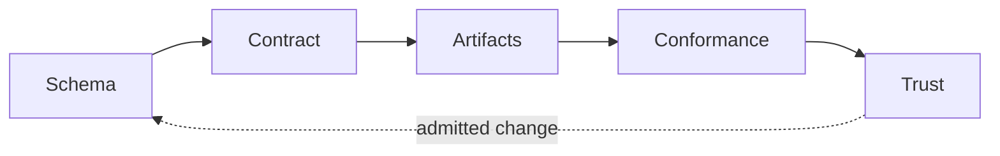

# Governed Message Artifact Family

> Governed review projection
>
> Contract: `governed-message-artifact-family.v1` | Version: `1.14.0` | Status: `admitted`

## Future-State Preview

One admitted contract projects the complete artifact family and the architecture review document used to inspect it.

The review document is derived from structured contract authority, so its artifact inventory, projection bindings, relationships, conformance gates, and trust vocabulary cannot drift independently.

## Reviewer Perspective

As an architecture reviewer, I need to inspect the complete admitted artifact authority in one deterministic document, so that projection and conformance decisions can be reviewed without manually reconstructing the JSON contract.

## Governing Loop



## Contract Authority

| Coordinate | Admitted value |
| --- | --- |
| Contract type | `governed-artifact-contract.v1` |
| Contract ID | `governed-message-artifact-family.v1` |
| Contract version | `1.14.0` |
| Contract status | `admitted` |
| Engine | `governed-artifact-engine.0.21.0` / `sha256:2fc2f89e1ec5402d34ff86655f554b3e8add78a4bc6f6ba07086a86e8e927ad3` |
| Schema identity | `https://canonical.local/schemas/governed-artifact-contract.schema.json` |
| Schema digest | `sha256:beea2f82130ea5c4b419c70374deb0aaa0c7a98763a92eabac24894af635e8d4` |
| Conformance profile | `closed-world-artifact-conformance.v8` / `sha256:e3362972b4629c285cb9ef5474936379b6b87b7f4124dc5670927792f049b1f7` |
| Projector registry | `governed-artifact-projector-registry.v1` / `sha256:1ab8ec48c80324c862cf598813554847fc4224ecb146e8dbddf7d9b1efdb2785` |
| Verifier registry | `governed-artifact-verifier-registry.v1` / `sha256:fb7df5deb813be792c2da1fd573f2456236c5af17594001c803d2fc10899c17a` |
| Migration registry | `governed-artifact-migration-registry.v1` / `sha256:7b4e0ee1074288b095d6f71d7430299447a9498c40ceb14106c858b2991a766b` |

## Semantic Subject

| Coordinate | Admitted value |
| --- | --- |
| Subject type | `artifact-family` |
| Subject ID | `governed-message-artifact-family.v1` |
| Purpose | Prove deterministic governance across a heterogeneous artifact family. |

Structured subject authority:

```json
{
  "closedLoop": [
    "schema",
    "contract",
    "artifacts",
    "conformance",
    "trust"
  ]
}
```

## Artifact Family

| Artifact | Kind | Purpose | Relative path | Media type | Ownership | Mutability |
| --- | --- | --- | --- | --- | --- | --- |
| `message-schema.v1` | `json-schema` | Constrains the governed message value. | `contracts/message.schema.json` | `application/schema+json` | `contract-owned` | `replace-by-projection` |
| `message-contract.v1` | `json-contract` | Declares the message consumed by the artifact family. | `contracts/message.json` | `application/json` | `contract-owned` | `replace-by-projection` |
| `message-projector-authority.v1` | `semantic-execution-authority` | Materializes the contract-declared message projection semantics as runtime data. | `contracts/project-message.authority.json` | `application/json` | `contract-owned` | `replace-by-projection` |
| `message-projector.v1` | `javascript-module` | Projects canonical message bytes from a validated value. | `src/project-message.mjs` | `text/javascript` | `contract-owned` | `replace-by-projection` |
| `message-command.v1` | `javascript-command` | Reads the declared message and writes its canonical bytes. | `bin/run-message.mjs` | `text/javascript` | `contract-owned` | `replace-by-projection` |
| `message-verification.v1` | `verification-command` | Evaluates the declared message projection. | `verification/verifies-message.mjs` | `text/javascript` | `contract-owned` | `replace-by-projection` |
| `artifact-family-readme.v1` | `markdown-document` | Projects the complete contract authority into an architecture review document. | `README.md` | `text/markdown` | `contract-owned` | `replace-by-projection` |
| `closed-loop-diagram.v1` | `mermaid-diagram` | Shows the governed closed loop. | `architecture/closed-loop.mmd` | `text/vnd.mermaid` | `contract-owned` | `replace-by-projection` |
| `artifact-family-manifest.v1` | `package-manifest` | Declares the executable artifact-family entrypoints. | `package.json` | `application/json` | `contract-owned` | `replace-by-projection` |
| `design-decision-record.v1` | `markdown-document` | Projects the governed design decision record derived from the authorizing conversation. | `architecture/decisions/cryptographic-lineage.md` | `text/markdown` | `contract-owned` | `replace-by-projection` |

### Proof Requirements

| Artifact | Verifiers | Requirements |
| --- | --- | --- |
| `message-schema.v1` | `content-digest-verifier.v1`, `json-meta-schema-verifier.v1` | content digest; meta-schema |
| `message-contract.v1` | `content-digest-verifier.v1` | content digest |
| `message-projector-authority.v1` | `content-digest-verifier.v1` | content digest |
| `message-projector.v1` | `artifact-provenance-verifier.v1`, `authority-closure-verifier.v1`, `content-digest-verifier.v1`, `source-token-structure-verifier.v1` | content digest |
| `message-command.v1` | `artifact-provenance-verifier.v1`, `authority-closure-verifier.v1`, `content-digest-verifier.v1`, `source-token-structure-verifier.v1` | content digest |
| `message-verification.v1` | `artifact-provenance-verifier.v1`, `authority-closure-verifier.v1`, `content-digest-verifier.v1`, `source-token-structure-verifier.v1` | content digest |
| `artifact-family-readme.v1` | `content-digest-verifier.v1`, `markdown-section-verifier.v1` | content digest; sections: # Governed Message Artifact Family, ## Future-State Preview, ## Reviewer Perspective, ## Governing Loop, ## Contract Authority, ## Semantic Subject, ## Artifact Family, ## Projection Authorities, ## Dependency Authorities, ## Effect Authorities, ## Runtime Authorities, ## Source Authority Closures, ## Authority Closure Profile, ## Artifact Scope Authority, ## Operation Authorities, ## Artifact Relationships, ## Exclusions, ## Conformance Evaluation, ## Terminal Dispositions, ## Receipt Requirements, ## Claim Policies, ## Review Checklist |
| `closed-loop-diagram.v1` | `content-digest-verifier.v1` | content digest |
| `artifact-family-manifest.v1` | `content-digest-verifier.v1` | content digest |
| `design-decision-record.v1` | `content-digest-verifier.v1` | content digest |

Content digests and byte lengths remain in the JSON contract. They are excluded from this review projection so the review artifact never becomes an input to its own content commitment.

## Projection Authorities

| Artifact | Mode | Projector | Authority | Authority type |
| --- | --- | --- | --- | --- |
| `message-schema.v1` | `projected` | `canonical-json-value-projector.v1` | `message-schema-authority.v1` | `canonical-json-value.v1` |
| `message-contract.v1` | `projected` | `canonical-json-value-projector.v1` | `message-contract-authority.v1` | `canonical-json-value.v1` |
| `message-projector-authority.v1` | `projected` | `canonical-json-value-projector.v1` | `message-projector-semantic-authority.v1` | `canonical-json-value.v1` |
| `message-projector.v1` | `projected` | `provenance-sealed-source-projector.v1` | `message-projector-authority.v1` | `lossless-source-tokens.v1` |
| `message-command.v1` | `projected` | `provenance-sealed-source-projector.v1` | `message-command-authority.v1` | `lossless-source-tokens.v1` |
| `message-verification.v1` | `projected` | `provenance-sealed-source-projector.v1` | `message-verification-authority.v1` | `lossless-source-tokens.v1` |
| `artifact-family-readme.v1` | `projected` | `governed-artifact-contract-markdown-projector.v1` | `artifact-family-readme-authority.v1` | `governed-artifact-contract-markdown.v1` |
| `closed-loop-diagram.v1` | `projected` | `utf8-text-projector.v1` | `closed-loop-diagram-authority.v1` | `utf8-text.v1` |
| `artifact-family-manifest.v1` | `projected` | `canonical-json-value-projector.v1` | `artifact-family-manifest-authority.v1` | `canonical-json-value.v1` |
| `design-decision-record.v1` | `projected` | `design-decision-record-projector.v1` | `design-decision-record-authority.v1` | `canonical-json-value.v1` |

## Dependency Authorities

| Dependency | Specifier | Allowed imports | Allowed invocations | Used by artifacts | Authority |
| --- | --- | --- | --- | --- | --- |
| `message-projector-authority-data.v1` | `../contracts/project-message.authority.json` | `default` |  | `message-projector.v1` | `message-projector-authority-data.v1` / `read-semantic-authority` |
| `message-projector-module.v1` | `../src/project-message.mjs` | `projectMessage` | `projectMessage` | `message-command.v1`, `message-verification.v1` | `message-projector.v1` / `invokes` |
| `message-projector-schema-data.v1` | `../contracts/message.schema.json` | `default` |  | `message-projector.v1` | `message-projector-schema-data.v1` / `read-semantic-schema` |
| `node-assert-strict.v1` | `node:assert/strict` | `default` | `default.equal` | `message-verification.v1` | `assert-message-projection.v1` / `evaluate-proof` |
| `node-fs-read.v1` | `node:fs` | `readFileSync` | `readFileSync` | `message-command.v1`, `message-verification.v1` | `read-message-contract.v1` / `read-file-system` |
| `semantic-projection-runtime.v1` | `contract-driven-artifact-governance-engine` | `executeSemanticProjection` | `executeSemanticProjection` | `message-projector.v1` | `semantic-projection-runtime.v1` / `execute-semantic-authority` |

## Effect Authorities

| Effect | Operation | Used by artifacts | Port | Authority |
| --- | --- | --- | --- | --- |
| `read-message-input.v1` | `process.argv` | `message-command.v1` | `read-message-input.v1` | `read-process-arguments` |
| `write-message-output.v1` | `process.stdout.write` | `message-command.v1`, `message-verification.v1` | `write-message-output.v1` | `write-process-output` |

## Runtime Authorities

| Runtime authority | Invocation | Used by artifacts | Purpose |
| --- | --- | --- | --- |
| `parse-json-runtime.v1` | `JSON.parse` | `message-command.v1`, `message-verification.v1` | Parses admitted UTF-8 JSON input. |
| `semantic-projection-runtime.v1` | `executeSemanticProjection` | `message-projector.v1` | Executes contract-declared validation, DTO projection, failure, and result serialization semantics. |
| `url-construction-runtime.v1` | `new URL` | `message-command.v1`, `message-verification.v1` | Resolves the declared message-contract location. |

## Source Authority Closures

| Artifact | Object-graph closure | Responsibilities | Semantic edges | Decisions | Iterations | Failure policies | Projection mappings | Result contracts |
| --- | --- | --- | --- | --- | --- | --- | --- | --- |
| `message-projector.v1` | `invocation-only.v1` | `message-projector-module.v1`, `project-message.v1` | `construct-invalid-message-error.v1`, `serialize-message-dto.v1`, `bind-message-schema-authority.v1`, `bind-project-message-authority.v1`, `execute-project-message-semantics.v1` | `invalid-message-guard.v1`, `message-precondition-chain.v1` |  | `invalid-message-failure.v1` | `message-output-dto.v1` | `projected-message-json.v1` |
| `message-command.v1` | `invocation-only.v1` | `run-message-command.v1` | `parse-command-message-json.v1`, `project-command-message.v1`, `read-command-message.v1`, `read-message-input-reference.v1`, `resolve-command-message-url.v1`, `write-message-output-edge.v1` | `default-message-input.v1` |  |  |  | `message-command-output.v1` |
| `message-verification.v1` | `invocation-only.v1` | `verify-message-projection.v1` | `assert-message-projection-edge.v1`, `parse-verification-message-json.v1`, `project-verification-message.v1`, `read-verification-message.v1`, `resolve-verification-message-url.v1`, `write-verification-proof-edge.v1` |  |  |  |  | `message-verification-signal.v1` |

## Authority Closure Profile

The following closed-world authority posture is supplied by the content-addressed conformance profile. Exact coverage includes explicitly empty authority collections.

```json
{
  "admission": {
    "requiredDisposition": "ARTIFACT_AUTHORITY_CLOSED"
  },
  "authorityType": "closed-world-authority-closure.v1",
  "coverage": {
    "artifactPaths": "exact",
    "artifactScope": "exact",
    "claimProofRequirements": "exact",
    "decisions": "exact",
    "declarations": "exact",
    "dependencies": "exact",
    "dependencyImports": "exact",
    "dependencyInvocations": "exact",
    "effects": "exact",
    "failurePolicies": "exact",
    "iterations": "exact",
    "ontologyAuthorities": "exact",
    "ontologyExecutionBindings": "exact",
    "operationAuthorities": "exact",
    "projectionMappings": "exact",
    "responsibilities": "exact",
    "resultContracts": "exact",
    "runtimeAuthorities": "exact",
    "semanticEdges": "exact"
  },
  "resolution": {
    "ambientAuthority": "forbidden",
    "ambiguousObservations": "reject",
    "cardinality": "exactly-one",
    "missingDeclaredAuthorities": "reject",
    "undeclaredObservations": "reject",
    "unresolvedObservations": "reject"
  }
}
```

## Artifact Scope Authority

The governed path set below defines inventory authority. Paths outside it receive the declared outside-authority posture without implicit ignore rules.

```json
{
  "artifactRoot": "governed-message-artifact-family",
  "governedDirectories": [],
  "inventoryMode": "exclusive-subtree",
  "outsideScopePosture": "outside-authority",
  "requiredDisposition": "ARTIFACT_SCOPE_CLOSED",
  "resolvedGovernedPathSet": [
    {
      "pathKind": "exclusion",
      "relativePath": ".env"
    },
    {
      "authorityId": "closed-loop-diagram.v1",
      "pathKind": "artifact",
      "relativePath": "architecture/closed-loop.mmd"
    },
    {
      "authorityId": "design-decision-record.v1",
      "pathKind": "artifact",
      "relativePath": "architecture/decisions/cryptographic-lineage.md"
    },
    {
      "authorityId": "message-command.v1",
      "pathKind": "artifact",
      "relativePath": "bin/run-message.mjs"
    },
    {
      "authorityId": "message-contract.v1",
      "pathKind": "artifact",
      "relativePath": "contracts/message.json"
    },
    {
      "authorityId": "message-schema.v1",
      "pathKind": "artifact",
      "relativePath": "contracts/message.schema.json"
    },
    {
      "authorityId": "message-projector-authority.v1",
      "pathKind": "artifact",
      "relativePath": "contracts/project-message.authority.json"
    },
    {
      "authorityId": "artifact-family-manifest.v1",
      "pathKind": "artifact",
      "relativePath": "package.json"
    },
    {
      "authorityId": "artifact-family-readme.v1",
      "pathKind": "artifact",
      "relativePath": "README.md"
    },
    {
      "pathKind": "exclusion",
      "relativePath": "secrets.json"
    },
    {
      "authorityId": "message-projector.v1",
      "pathKind": "artifact",
      "relativePath": "src/project-message.mjs"
    },
    {
      "authorityId": "message-verification.v1",
      "pathKind": "artifact",
      "relativePath": "verification/verifies-message.mjs"
    }
  ],
  "scopeType": "exclusive-artifact-subtree.v1",
  "workspaceRoot": "."
}
```

## Operation Authorities

The contract is the sole authored change authority. Governed artifacts are replace-only projections, and proof is observational.

```json
{
  "authoredMutation": {
    "governedArtifacts": "forbidden",
    "posture": "sole-authored-change-authority",
    "target": "contract"
  },
  "authorityType": "governed-operation-authorities.v3",
  "bodyPurity": {
    "admittedAuthorityTypes": [
      "semantic-projection-authority.v1",
      "semantic-execution-bundle.v1"
    ],
    "allowedExecutableForms": [
      "single-semantic-invocation",
      "direct-return",
      "declared-port-binding"
    ],
    "applicability": "artifacts-bound-to-semantic-authority-executor-port",
    "consumerRelaxation": "forbidden",
    "exactCardinality": {
      "exportedResponsibilities": 1,
      "resultFlows": 1,
      "semanticInvocations": 1
    },
    "executionPortEffect": "execute-semantic-authority",
    "forbiddenExecutableMechanics": [
      "branch",
      "iteration",
      "exception-handling",
      "throw",
      "object-construction",
      "serialization",
      "normalization",
      "validation",
      "fallback",
      "retry",
      "state-mutation",
      "meaning-hidden-in-text"
    ],
    "profileType": "semantic-execution-body.v2",
    "semanticAuthorityLocation": "contract"
  },
  "migration": {
    "artifactProjection": "forbidden",
    "mode": "candidate-first",
    "operation": "migrate",
    "sourceInterpretation": "historical-schema-digest",
    "targetMutation": "contract-only",
    "trustIssuance": "forbidden",
    "writeMode": "explicit-only"
  },
  "mutationAuthority": {
    "authorityType": "single-source-mutation-authority.v1",
    "consumerAuthoredAuthority": {
      "cardinality": "exactly-one",
      "source": "contract",
      "target": "contract"
    },
    "controlEvidenceMutation": {
      "createOrReplace": "contract-declared-control-paths-only",
      "remove": "forbidden"
    },
    "derivedContractMutation": {
      "admittedOperations": [
        "migrate",
        "reconcile"
      ],
      "target": "contract"
    },
    "governedArtifactMutation": {
      "authoritySource": "validated-contract",
      "create": "declared-projections-only",
      "interpretationBase": "digest-bound",
      "remove": "forbidden",
      "replace": "declared-projections-only",
      "undeclaredState": "observe-and-reject"
    }
  },
  "projection": {
    "artifactPosture": "replace-by-projection",
    "operation": "project",
    "subjectMutation": "declared-projections-only",
    "writeMode": "explicit-only"
  },
  "proof": {
    "artifactProjection": "forbidden",
    "declaredEvaluations": "read-only",
    "mode": "read-only",
    "mutationDisposition": "EVALUATION_INVALIDATED_BY_MUTATION",
    "operation": "prove",
    "receiptTarget": "outside-governed-subject",
    "receiptWrite": "explicit-only",
    "requiredSubjectDisposition": "PROOF_SUBJECT_UNCHANGED",
    "subjectMutation": "forbidden"
  },
  "reconciliation": {
    "artifactProjection": "forbidden",
    "candidateProjection": "in-memory",
    "contractMutation": "commitment-fields-only",
    "mode": "candidate-first",
    "operation": "reconcile",
    "trustIssuance": "forbidden",
    "writeMode": "explicit-only"
  }
}
```

## Artifact Relationships

| Source artifact | Relationship | Target artifact |
| --- | --- | --- |
| `message-contract.v1` | `conforms-to` | `message-schema.v1` |
| `message-projector-authority.v1` | `reads` | `message-schema.v1` |
| `message-projector.v1` | `projects` | `message-contract.v1` |
| `message-projector.v1` | `reads` | `message-projector-authority.v1` |
| `message-projector.v1` | `reads` | `message-schema.v1` |
| `message-command.v1` | `reads` | `message-contract.v1` |
| `message-command.v1` | `invokes` | `message-projector.v1` |
| `message-verification.v1` | `verifies` | `message-contract.v1` |
| `message-verification.v1` | `verifies` | `message-projector.v1` |
| `message-verification.v1` | `invokes` | `message-projector.v1` |
| `artifact-family-readme.v1` | `documents` | `message-command.v1` |
| `artifact-family-readme.v1` | `documents` | `message-verification.v1` |
| `closed-loop-diagram.v1` | `documents` | `artifact-family-readme.v1` |
| `artifact-family-manifest.v1` | `invokes` | `message-command.v1` |
| `artifact-family-manifest.v1` | `invokes` | `message-verification.v1` |
| `design-decision-record.v1` | `documents` | `closed-loop-diagram.v1` |

## Exclusions

- `.env`
- `secrets.json`

## Conformance Evaluation

Fail closed: `true`

Evaluation order:

1. `validate-contract`
2. `resolve-artifact-plan`
3. `observe-artifact-state`
4. `classify-workspace-paths`
5. `resolve-design-authority`
6. `resolve-artifact-lineage`
7. `evaluate-artifact-inventory`
8. `evaluate-projection-identity`
9. `evaluate-authority-closure`
10. `evaluate-ontology-authority`
11. `evaluate-semantic-execution-bodies`
12. `evaluate-structured-meaning-authority`
13. `evaluate-artifact-content`
14. `evaluate-artifact-structure`
15. `evaluate-artifact-freshness`
16. `evaluate-artifact-relationships`
17. `evaluate-declared-commands`
18. `verify-proof-subject-stability`
19. `issue-trust-disposition`

Declared command evaluations:

| Evaluation | Verifier | Command | Exit code | Required standard output |
| --- | --- | --- | --- | --- |
| `message-projection-evaluation.v1` | `command-exit-verifier.v1` | `node verification/verifies-message.mjs` | `0` | `ARTIFACT_TEST_CONFORMS` |

## Terminal Dispositions

Contract validation:

- `CONTRACT_VALID`
- `CONTRACT_INVALID`
- `SCHEMA_NOT_ADMITTED`
- `SCHEMA_DIGEST_MISMATCH`

Artifact conformance:

- `ARTIFACT_MISSING`
- `ARTIFACT_UNDECLARED`
- `ARTIFACT_CONTENT_MISMATCH`
- `ARTIFACT_STRUCTURE_MISMATCH`
- `ARTIFACT_STALE`
- `PROJECTION_IDENTITY_MISMATCH`
- `ARTIFACT_ESCAPES_CONTRACT`
- `EVALUATION_INVALIDATED_BY_MUTATION`
- `ONTOLOGY_AUTHORITY_CLOSED`
- `SEMANTIC_EXECUTION_BODY_CLOSED`
- `CONTRACT_AUTHORITY_CLOSED`
- `WORKSPACE_AUTHORITY_CLOSED`
- `WORKSPACE_AUTHORITY_OPEN`
- `CANONICAL_LINEAGE_CLOSED`
- `CANONICAL_LINEAGE_OPEN`
- `ARTIFACT_PROVENANCE_SEALED`
- `DESIGN_AUTHORITY_CLOSED`
- `DESIGN_AUTHORITY_OPEN`

Trust postures:

- `CONFORMS`
- `DRIFTED`
- `MISSING`
- `EXTRA`
- `STALE`
- `CONTAMINATED`
- `NOT_EVALUATED`

Trust dispositions:

- `TRUSTED`
- `REJECTED`
- `NOT_EVALUATED`

## Receipt Requirements

| Evidence record | Type | Relative path |
| --- | --- | --- |
| Projection ledger | `governed-artifact-projection-ledger.v1` | `.governance/projections/governed-message-artifact-family.ledger.json` |
| Conformance receipt | `governed-artifact-conformance-receipt.v1` | `.governance/receipts/governed-message-artifact-family.receipt.json` |

Projection-ledger evidence:

- `contract-identity`
- `interpretation-base`
- `projector-registry-identity`
- `artifact-scope-authority`
- `authority-closure-profile`
- `operation-authorities`
- `dependency-authorities`
- `effect-authorities`
- `runtime-authorities`
- `source-authorities`
- `ontology-authorities`
- `artifact-projection-identities`
- `artifact-content-commitments`
- `workspace-authority`
- `canonical-lineage`
- `conversation-design-authority`

Conformance-receipt evidence:

- `contract-identity`
- `interpretation-base`
- `schema-identity`
- `registry-identities`
- `artifact-observations`
- `projection-identity`
- `artifact-scope-authority`
- `artifact-scope-observation`
- `authority-closure-profile`
- `authority-closure-disposition`
- `operation-authorities`
- `ontology-authorities`
- `proof-subject-stability`
- `source-authority-observations`
- `conformance-findings`
- `claim-policies`
- `trust-disposition`
- `workspace-authority`
- `canonical-lineage`
- `conversation-design-authority`

## Claim Policies

| Claim authority | Admitted claim | Required conformance | Required authority closure | Required artifact scope | Required proof | Required trust |
| --- | --- | --- | --- | --- | --- | --- |
| `artifact-family-complete.v1` | `COMPLETE` | `CONTRACT_AUTHORITY_CLOSED` | `ARTIFACT_AUTHORITY_CLOSED` | `ARTIFACT_SCOPE_CLOSED` | `PROOF_COMPLETE` | `TRUSTED` |
| `contract-authority-closed.v1` | `CONTRACT_AUTHORITY_CLOSED` | `CONTRACT_AUTHORITY_CLOSED` | `ARTIFACT_AUTHORITY_CLOSED` | `ARTIFACT_SCOPE_CLOSED` | `PROOF_COMPLETE` | `TRUSTED` |
| `artifact-family-trusted.v1` | `TRUSTED` | `CONTRACT_AUTHORITY_CLOSED` | `ARTIFACT_AUTHORITY_CLOSED` | `ARTIFACT_SCOPE_CLOSED` | `PROOF_COMPLETE` | `TRUSTED` |

## Review Checklist

- [ ] Every artifact path is enumerated and exact.
- [ ] Every import and package use resolves to one dependency authority.
- [ ] Every function resolves to one declared responsibility.
- [ ] Every invocation and governed reference resolves to one semantic edge.
- [ ] Every external operation resolves to one effect port.
- [ ] Every DTO field resolves to one projection mapping.
- [ ] Every branch and iteration resolves to a named authority.
- [ ] Every thrown failure resolves to one failure policy.
- [ ] Every return or emitted result resolves to one result contract.
- [ ] Every trust claim resolves to a named proof requirement.
- [ ] The closed-world authority-closure profile is exact and immutable.
- [ ] The artifact inventory resolves through one explicit governed-scope authority.
- [ ] The contract is the sole authored change authority, every governed artifact is replace-only projected state, and proof is observational.
